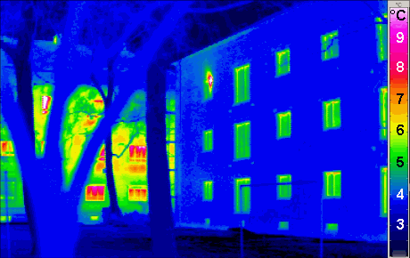
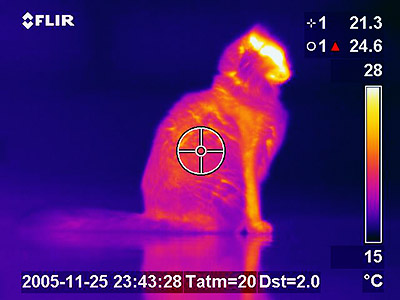
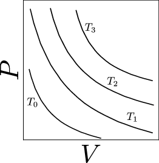

---
author:
- Orestis Malaspinas
title: Résumé du cours de Physique Générale
autoSectionLabels: true
autoEqnLabels: true
eqnPrefix: 
  - "éq."
  - "éqs."
chapters: true
numberSections: true
chaptersDepth: 1
sectionsDepth: 3
lang: fr
documentclass: book
papersize: A4
cref: false
pandoc-numbering:
  - category: exercice
    listing: Liste des exercices
urlcolor: blue
corrige: false
---

Avertissement {#avertissement .unnumbered}
=============

Cette tentative de polycopié contient certainement un grand nombre
d’erreurs étant donné qu’elle est développée en même temps que le cours
est donné et qu’elle en est à ses premiers mois de vie. Quand vous
trouverez des erreurs n’hésitez pas à me les communiquer et ainsi
améliorer la qualité de ce polycopié. Toute erreur trouvée concernant de
la “physique” (pas les fautes d’orthographe donc) seront récompensées
par un bonus sur la note des contrôles continus.

Bibliographie {#bibliographie .unnumbered}
=============

Il existe une multitude de bons livres de physique générale à
disposition. Ce polycopié est largement inspiré du livre de D. C.
Giancoli, *Physics: principles with applications*, 7-th edition,
Pearson, 2014. D’autres lectures possibles sont les suivantes:

-   Walker, Halliday & Resnick, Fundamentals of Physics, Wiley, 2014.

-   E. Hecht, Physique, 1999.

Une partie de la bibliographie que je vous ai donné est en anglais. Il
existe des traductions qui sont en principe disponibles à la
bibliothèque.

Mesures, incertitudes, et estimations
=====================================

Pour celles et ceux qui sont intéressés par plus de détails, vous pouvez
vous référer au cours de métrologie de l’EPFL par exemple:
<http://sb.epfl.ch/page-52191-en.html>

Généralités
-----------

Toues les sciences “naturelles” sont basées sur *l’observation* du monde
qui nous entoure. Mais malgré le fait qu’on ait l’impression que le
processus d’observation soit une suite simple: observation,
expérimentation, obtention de résultats, qu’on explique avec une
*théorie* (un ensemble de *lois*) cela n’est pas vraiment le cas. En
fait, de façon proche à ce qui se passe dans les arts, les sciences sont
un processus hautement créatif. En effet, lors d’une observation un
scientifique ne décrit pas tout ce qu’il voit, mais sélectionne
uniquement ce qu’il juge important pour la compréhension et
l’interprétation d’un phénomène. De plus, une fois sélectionné le
processus à observer, il convient de créer une expérience permettant de
le mesurer de façon aussi précise que possible pour pouvoir le décrire.
La mesure tient donc une place centrale dans les sciences et se complète
parfaitement avec la création de théories qui permettent l’explication
d’observations. Par ailleurs, toutes les théories ne sont pas le fruit
d’expériences (ou d’observations) mais ont souvent été le résultat de
constructions de l’esprit. Dans ce cas les expériences, viennent
confirmer (ou infirmer) les théories. En effet, une théorie physique est
supposée vraie jusqu’à ce qu’une expérience vienne l’infirmer (on ne
peut pas prouver une théorie).

Les expériences ont donc deux fonctions principales

-   Collecter des données qui permettront la dérivation de lois
    physiques.

-   Vérifier ou infirmer les lois physiques.

Les lois physiques sont des outils très pratiques permettant la
prédiction *quantitative* de phénomènes (et non la “post-diction” comme
avec les expériences). Il est par exemple possible de prédire très
précisément la hauteur à laquelle il faut lancer un satellite pour qu’il
se retrouve en orbite géostationnaire (et donc connaître la quantité de
carburant nécessaire par exemple) grâce aux lois de Newton. Ce qui
serait certainement beaucoup plus difficile à déterminer
expérimentalement, s’il fallait faire des dizaines d’essais jusqu’à ce
que ça marche.

Par ailleurs, beaucoup de “lois” ont des capacités prédictives mais ne
sont pas complètement générales. Par exemple, bien que les lois de
Newton marchent très très bien pour notre vie de tous les jours,
certaines applications d’usage quotidien ne fonctionneraient pas si on
s’en tenait là. En effet, le GPS requiert l’extension des lois de Newton
à la relativité générale pour pouvoir fonctionner correctement. En fait
la gravitation Newtonienne est une approximation de la relativité
générale.

Ces approximations sont souvent le résultat de simplifications faites
dans la représentation dont ont se fait de processus physiques: les
*modèles*. Un modèle est une vision de l’esprit qui permet de réunir
plusieurs situations qui à première vue peuvent paraître non-semblables
ou à simplifier un problème afin de pouvoir le résoudre plus simplement.
Par exemple un liquide est composé d’atomes qui se déplacent. Il serait
possible (mais complètement infaisable et inutile dans presque tous les
cas) d’étudier chaque atome individuellement pour avoir une description
très détaillée du mouvement d’un fluide. Néanmoins, il est beaucoup plus
simple de faire *l’hypothèse* qu’un fluide peut être considéré comme un
objet continu.

Mesure et incertitude
---------------------

Comme nous venons de le dire les mesures tiennent une place primordiale
en physique. Mais toute mesure ne peut être parfaite et contient donc
une part d’incertitude. En générale l’incertitude d’une mesure provient
de la précision limitée des instruments utilisés. Par exemple, lors de
la mesure d’une longueur avec une règle, la graduation est en générale
faite à chaque millimètre. Il est donc impossible d’être plus précis que
le millimètre (on pourrait éventuellement dire qu’on est précis à 0.5
millimètres, mais il faudrait pour cela que l’utilisateur de la règle
ait de très très très bons yeux, que le fabriquant de la règle ait un
processus absolument parfait de graduation, etc). Si la longueur, $L$,
d’un objet mesuré à la règle est de $10.1{\mathrm{cm}}$, on peut donner
l’information de l’incertitude en ajoutant derrière le sigle
$\pm 0.1{\mathrm{cm}}$ ou $$L=10.1\pm0.1\ {\mathrm{cm}}.$$ Cela signifie
que la valeur de $L$ est située quelque part entre $10$ et $10.2$
centimètres. Une autre façon de mesurer la précision d’une mesure est de
donner l’erreur en pourcentage de la mesure effectuée. Ici nous aurions
que l’erreur est de $$\frac{0.1}{10.1}\cdot 100\cong 1\%.$$ Cette façon
de quantifier l’erreur dépend donc de la valeur de la quantité mesurée
(plus la longueur mesurée est grande plus le pourcentage sera petit et
inversement).

Une autre source d’incertitude peut provenir de la nature du phénomène
observé. Si nous mesurions aujourd’hui la température à un endroit donné
de Genève durant toute la journée nous verrions une certaine courbe de
température. Cette courbe serait certainement différente de la courbe du
lendemain ou de celle du même jour de l’année d’après. Ces mesures non
reproductibles doivent donc faire l’objet d’études statistiques et
contiennent des incertitudes de nature très différentes (en plus des
erreurs dues aux mesures elles-mêmes).

### Chiffres significatifs

Le nombre de chiffres significatifs est le nombre de chiffres d’un
résultat dont la valeur est “sûre”. Le nombre $1.23$ contient trois
chiffres significatifs tout comme le nombre $0.0123$ (les zéros ne sont
là que pour placer la virgule). La façon dont on donne un résultat
permet donc d’indiquer avec quelle précision nous connaissons un
résultat. Il est souvent tentant d’exprimer un résultat avec un grand
nombre de chiffres significatifs, mais cela peut s’avérer extrêmement
contre productif car cela donne une fausse impression de grande
précision d’une mesure. Si nous reprenons notre mesure avec la règle de
la longueur $L=10.1$. En se donnant un peu de peine on peut facilement
se convaincre qu’on a pas exactement $10.1$ mais un peu plus disons
$10.15$. Même si cela n’est pas vraiment grave dans ce cas, le $5$ est
totalement superflu car il est complètement impossible de dire si cela
est 10.15 ou 10.13 “à l’œil”. De façon générale si notre précision avait
été de $\pm 1{\mathrm{cm}}$ on aurait écrit $L=10$, à $\pm 0.1$ on écrit
$10.1$, à $\pm 0.01$ on écrit $10.10$, etc. Par ailleurs, lorsqu’on
combine des valeurs contenant des incertitudes il faut également faire
attention. Supposons que nous ayons un carré dont le coté fait
$10.1{\mathrm{cm}}$, sa surface est de $10.1^2=102.01$. Hors, la valeur
de la surface est incluse entre les deux valeurs extrêmes possibles:
$10^2=100$ et $10.2^2=104.04$. Il est donc inutile de garder $0.01$ et
on donne la valeur de $102$ pour la surface.

Il est commun d’écrire les nombre en *notation scientifique* ou en
puissances de $10$. Le nombre $10'100$ s’écrit $1.01\cdot 10^4$ en
notation scientifique, le nombre $0.001234=1.234\cdot 10^{-3}$, ... Un
des avantages de la notation scientifique, c’est qu’elle permet
immédiatement de connaître le nombre de chiffres significatifs d’un
résultat: il correspond au nombre de chiffres composant le nombre
multiplié par la puissance de $10$.

Unités, Système International
-----------------------------

Toute mesure doit être effectuée par rapport à un “standard” ou unités.
Cela n’a aucun sens de dire qu’un éléphant pèse 36, si nous ne disons
pas 36 en quelles unités. Pour chaque grandeur de multiple standards ont
été créé au cours des années qui sont devenus de plus en plus précis
avec les avancées technologiques (combien exactement mesure
$1{\mathrm{m}}$, la durée d’une seconde, etc). Dans cette section nous
allons discuter les unités des grandeurs de base de la physique. Nous
verrons en particulier le *Système International* (ou SI).

Ne pas se mettre d’accord sur un système d’unités peut avoir des
conséquences catastrophiques. Un exemple récent est la perte du
satellite Mars Climate Orbiter (le coût de la mission était de 330
millions de dollars) qui a explosé alors qu’il essayait de se mettre en
orbite autour de Mars, car une partie du code informatique récoltant les
donnée de la sonde donnait des résultats en unités non-SI alors que la
NASA travaillait en SI. Il y a donc eu une très grossière erreur dans le
calcul de la trajectoire à adopter pour la mise en orbite et le
satellite s’est écrasé (plus de détails ici par exemple
<https://fr.wikipedia.org/wiki/Mars_Climate_Orbiter>).

Les unités sont définies par rapport à des grandeurs “facilement”
mesurables avec une grade précision et qui ne changent pas (ou très très
très peu) au cours du temps.

### Longueur

Le standard international fût établi par la France dans les années 1790.
Pour les unités de longueur est le mètre (abrégé ${\mathrm{m}}$). A
l’origine le mètre était 1/10’000’000 de la distance entre l’équateur et
un des pôles. A partir de cette mesure un étalon en platine fût forgé
(c’est quand même plus pratique à utiliser). Puis, en 1889, le mètre a
été défini comme la distance entre deux très fines encoche sur une barre
d’un alliage platine-iridium. Comme cette façon de définir le mètre
n’était pas suffisamment précise pour beaucoup d’applications, en 1960
le mètre devint $1'650'763.73$ longueur d’onde d’une lumière émise par
le gaz krypton-86. En 1983, fût redéfini comme la distance parcourue par
la lumière en 1/299’792’458 secondes.

Il existe d’autres unités de longueur, par exemple les britanniques
utilisent le pouce ou inch (1$\mathrm{in.}$ correspond à
0.0254${\mathrm{m}}$). Dans ce cours nous nous concentrerons
principalement sur le système SI.

A titre de comparaison la @fig:imperial montre les relations entre les 
différentes unités de longueur qui existaient dans l'empire britannique. 
On y voit un très grand nombre d'unités différentes reliées entre elles par des relations
plus ou moins compliquées. La page wikipedia 
<https://fr.wikipedia.org/wiki/Unit%C3%A9s_de_mesure_anglo-saxonnes> contient les unités anglosaxonnes
pour des surfaces et des volumes également.

{#fig:imperial width=50%}

### Temps

La mesure du temps en SI est donnée en secondes (abrégée
${\mathrm{s}}$). Une seconde a longtemps été définie comme étant
$1/(3600\cdot 24)=1/86'000$-ème de journée solaire. La vitesse de
rotation de la terre se ralentissant légèrement d’année en année, il a
été nécessaire de raffiner de plus en plus cette définition. A présent
une seconde correspond à un processus atomique. Il s’agit du temps
nécessaire à 9’192’631’770 de la transitions entre deux états de l’atome
de césium 133.

### Masse

Le kilogramme (abrégé ${\mathrm{kg}}$) est la masse d’un étalon
international du kilogramme. En 1795, le kilogramme était la d’un
décimètre cube d’eau à une température de $4^\circ{\mathrm{C}}$. Puis il
a été remplacé par un étalon en platine iridié (voir Fig. {@fig:kg}).
Il s’agit de la seule unité utilisant encore un étalon, aucune “grandeur
naturelle” n’ayant pu être utilisée pour définir le kilogramme
autrement. Des copies de cet étalon ont été fabriquée et envoyées à
chaque état qui en ont fait d’autres copies officielles pour contrôler
les balances utilisées un peu partout sur les territoires.

{#fig:kg width=50%}

### Température

La température mesure le degré d’échauffement d’un corps. En SI l’unité
de la température est le degré Kelvin (abrégé ${\mathrm{K}}$). Il est
défini comme le $1/273.16$-ème de la température du point triple de
l’eau (la température où les trois phases, solides, liquides, gazeuse,
de l’eau peuvent coexister en équilibre thermodynamique). Cette
température se trouve par définition à $273.16^\circ{\mathrm{K}}$ ou
encore à $0.01^\circ{\mathrm{C}}$. Nous verrons un peu plus de détails
sur la définition du zéro degrés Kelvin (ou zéro absolu) dans la suite
du cours.

### Courant

L’intensité du courant électrique est mesurée en Ampères (abrégé
${\mathrm{A}}$). Un ampère est l’intensité de courant constant qui
circulerait dans deux fils conducteurs infinis placés dans le vide, de
section négligeable, et placés à une distance d’un mètre l’un de l’autre
qui produirait une force de $2\cdot 10^{-7}$ Newton par longueur de
mètre. Les autres unités très utiles en électricité, l’ohm (abrégé
$\Omega$) et le volt (abrégé ${\mathrm{V}}$) se déduisent ensuite par
les fameuse formules $U=R\cdot I$
($[{\mathrm{V}}]=[\Omega]\cdot [{\mathrm{A}}]$) et $P=U\cdot I$
($[{\mathrm{W}}]=[{\mathrm{V}}]\cdot [{\mathrm{A}}]$).

### Quantité de matière

La quantité de matière se mesure en moles (abrégé ${\mathrm{mol}}$). Une
mole de matière contient autant de particules que $0.012{\mathrm{kg}}$
contient d’atomes de Carbone 12 soit environ $6.02\cdot 10^{23}$ atomes
(on appelle ce nombre, le nombre d’Avogadro ou de Loschmidt). Cette
valeur est étonnamment constante. Pour tout élément du tableau
périodique une mole sera le nombre d’atomes d’élément de poids atomique
$N$ (ou $N$ unités de masse atomique), dans $N$ grammes de matière.

### Intensité lumineuse

L’intensité lumineuse est mesurée en candela (abrégé ${\mathrm{cd}}$).
Elle est donnée par l’intensité lumineuse émise par une source
monochromatique de fréquence de $540\cdot 10^{12}{\mathrm{s}}^{-1}$ et
dont l’intensité énergétique est de $1/683 {\mathrm{W}}$ par stéradian
(équivalent du radian mais sur une sphère). L’intensité lumineuse
représente la puissance (la quantité d’énergie par unité de temps) émise
par une source par angle solide.

A titre de comparaison, un candela est environ l’intensité lumineuse
émise par une bougie normale. Ou encore, une ampoule led typique à
faible consommation électrique (15 Watts) produit environ
10${\mathrm{cd}}$.

### Préfixes du Système International

Pour exprimer les puissances de 10 du SI, un certain nombre de préfixes
ont été définis pour simplifier les notations (voir la
Table {@tbl:prefixe}). Il est relativement aisé de convertir entre
les différents préfixes. Ainsi $23{\mathrm{cm}}$ correspondent à
$230{\mathrm{mm}}$ ou $0.23{\mathrm{m}}$. Pour le calcul de surfaces (ou
d’unités prises à une certaine puissance les choses se compliquent un
tout petit peu. Ainsi le préfixe est complètement attaché à l’unité. Par
exemple les unités d’un volume se convertissent comme
$$23{\mathrm{cm}}^3=23\cdot(10^{-2} m)^3=23\cdot 10^{-6}m^3.$$

  $10^n$       Préfixe français   Symbole   Nombre décimal                      Désignation
  ------------ ------------------ --------- ----------------------------------- -----------------
  $10^{24}$    yotta              Y         1 000 000 000 000 000 000 000 000   Quadrillion
  $10^{21}$    zetta              Z         1 000 000 000 000 000 000 000       Trilliard
  $10^{18}$    exa                E         1 000 000 000 000 000 000           Trillion
  $10^{15}$    péta               P         1 000 000 000 000 000               Billiard
  $10^{12}$    téra               T         1 000 000 000 000                   Billion
  $10^{9}$     giga               G         1 000 000 000                       Milliard
  $10^{6}$     méga               M         1 000 000                           Million
  $10^{3}$     kilo               k         1 000                               Millier
  $10^{2}$     hecto              h         100                                 Centaine
  $10^{1}$     déca               da        10                                  Dizaine
  $10^{0}$     (aucun)            —         1                                   Unité
  $10^{-1}$    déci               d         0,1                                 Dixième
  $10^{-2}$    centi              c         0,01                                Centième
  $10^{-3}$    milli              m         0,001                               Millième
  $10^{-6}$    micro              $\mu$     0,000 001                           Millionième
  $10^{-9}$    nano               n         0,000 000 001                       Milliardième
  $10^{-12}$   pico               p         0,000 000 000 001                   Billionième
  $10^{-15}$   femto              f         0,000 000 000 000 001               Billiardième
  $10^{-18}$   atto               a         0,000 000 000 000 000 001           Trillionième
  $10^{-21}$   zepto              z         0,000 000 000 000 000 000 001       Trilliardième
  $10^{-24}$   yocto              y         0,000 000 000 000 000 000 000 001   Quadrillionième

 Table: Préfixes du Système international d’unités et noms des nombres correspondants. {#tbl:prefixe} 

Exercice (Conversion d’unités) #

1.  Écrivez en mètres les grandeurs suivantes: $1{\mathrm{cm}}$,
    $1.23\cdot 10^6\mu{\mathrm{m}}$, $72\mathrm{da}{\mathrm{m}}$.

2.  Ajoutez les grandeurs suivantes $3\mu{\mathrm{g}}$,
    $7\mathrm{d}{\mathrm{g}}$, $120{\mathrm{kg}}$. Écrivez les en
    notation scientifique avec trois chiffres significatifs.

3.  Calculez le produit des grandeurs suivantes $8.76{\mathrm{m}}$,
    $5.43{\mathrm{mm}}$, $2.10\mu{\mathrm{m}}$. Que représente ce
    produit? Écrivez le résultat en ${\mathrm{m}}^3$ et en
    ${\mathrm{cm}}^3$.

4.  Le rayon d’un atome d’oxygène est d’environ $60\mathrm{pm}$. Combien
    d’atomes posés côte à côte faudrait-il pour faire $1{\mathrm{m}}$? A
    combien de ${\mathrm{mol}}$ cela correspondrait-il?

5.  Classez ces grandeurs par ordre croissant $1{\mathrm{mm}}$,
    $1{\mathrm{cm}}$, $1{\mathrm{m}}$, $1\mathrm{dam}$, $1\mathrm{pm}$,
    et $1\mathrm{dm}$.

Exercice (Préfixes SI) #

1.  Exprimez en utilisant les préfixes SI et le moins de chiffre
    possible les nombres suivants
    $$3\cdot 10^6{\mathrm{kg}},\quad 4\cdot10^{-9}{\mathrm{m}},\quad 56\cdot10^{-13}{\mathrm{s}},\quad 78\cdot 10^{14} \mathrm{A},\quad 0.56\cdot 10^1 \mathrm{K} ,\quad 912\cdot10^{19}{\mathrm{mol}}.$$

2.  On estime que le cerveau humain peut stocker environ cent mille
    milliards de bits d’informations.

    1.  Écrire ce nombre en forme décimale.

    2.  En notation scientifique.

    3.  Exprimer ce nombre en ajoutant un préfixe au mot bit.

    4.  Sachant qu’un byte correspond à 8bits, combien de bytes cela
        fait-il?

Ordre de grandeur
-----------------

Souvent nous pouvons vouloir qu’une estimation rapide d’une quantité ou
simplement vouloir rapidement avoir une idée de comment “marche” un
processus. Pour ce faire plutôt que d’entrer complètement dans tous les
détails compliqués des calculs il peut être beaucoup plus simple de
fonctionner avec des ordres de grandeurs de nos quantité (en gros on
arrondit tout à l’entier ou même à la puissance de 10)[^1]. On a donc un
résultat précis “à la puissance de 10 près”.

Exercice (Volume d'un lac) #

Calculez le volume du lac Léman sachant qu’il fait environ
$70{\mathrm{km}}$ de long pour $10{\mathrm{km}}$ de large et
$100{\mathrm{m}}$ de profondeur.[^2]

Exercice (Hauteur d’un bâtiment) #

Je souhaite estimer la hauteur d’un bâtiment. Supposons que mes yeux
soient à une hauteur de $1.5{\mathrm{m}}$ du sol. La seule information
connue est que quand je me place à une distance d’un écartement de bras
d’un arbre (mesurant environ $3{\mathrm{m}}$ de haut et se trouvant à
$20$ pas du bâtiment) placé entre moi et le bâtiment, l’arbre cache tout
juste le haut du bâtiment.

Exercice (Épaisseur d’une feuille de papier) #

Vous avez à disposition une règle (précise au millimètre) et un livre.
Estimez aussi précisément que possible et avec un minimum d’effort
l’épaisseur d’une feuille du livre.

Analyse dimensionnelle
----------------------

Lorsque nous parlons de dimensions d’une quantité, nous nous référons
souvent au type des unités de la quantité. Une longueur sera représentée
par $[L]$[^3], un temps par $[T]$, une masse par $[M]$, etc. Cette
notation se généralise pour toute quantité dont les quantités sont des
combinaisons (multiplication ou division) de ces unités de base. Ainsi,
une surface sera $[L^2]$, une fréquence $[1/T]$, une vitesse $[L/T]$,
une énergie $[M\cdot L^2/T^2]$, une force $[M L/T^2]$, etc.

Exercice (Quantité de grandeur de base) #

Écrivez les 5 types d’unités fondamentales nécessaires à la dérivation
de toutes les autres.

L’analyse dimensionnelle peut se révéler particulièrement utile pour
vérifier si des relations font du sens ou pas. Les lois physiques
mettent en relation différentes quantités qui doivent être consistante
également du point de vue des unités. On ne peut naturellement pas
additionner des quantités qui n’ont pas les mêmes unités. Cela
reviendrait à ajouter des éléphants à des lettres, le résultat serait
alors peu clair[^4].

Si nous prenons comme exemple la relation $$s=x_0+\frac{1}{2}v_0 t^2,$$
qui décrirait la position d’un objet en mouvement rectiligne uniforme,
$s$, qui partirait d’une position $x_0$, aurait une vitesse $v_0$ après
un temps $t$. Si nous effectuons l’analyse dimensionnelle de cette
relation nous avons $$\begin{aligned}
 [L]&\stackrel{?}{=}[L]+[L/T]\cdot [T^2],\nonumber\\
 &\neq[L]+[L\cdot T].\end{aligned}$$ On constate donc que cette équation
est certainement fausse. On note aussi que le $1/2$ n’ayant pas d’unités
a été simplement ignoré dans la relation ci-dessus, car il n’est pas
porteur d’unités.

Si le résultat de l’analyse dimensionnelle se révèle incohérent, nous
sommes certains que l’équation est fausse. L’inverse est cependant faux.
En effet, une analyse dimensionnelle d’une équation cohérente ne permet
pas d’être sûr que l’équation en elle-même est correcte. Par exemple
tous les facteurs numériques peuvent être complètement faux. Ou alors
certaines quantités peuvent avoir les bonnes unités mais n’avoir aucun
sens physique dans les cas étudiés.

Exercice (Analyse dimensionnelle) #

Essayez de deviner les relations entre les quantités suivantes à partir
de leurs dimensions

1.  Distance et vitesse.

2.  Accélération et vitesse.

3.  Distance et accélération.

4.  Énergie et vitesse.

5.  Force et énergie.

Température
===========

La température est une mesure reliée au “chaud” et au “froid” (qui sont
des mesures assez subjective). Une plaque de cuisine est chaude alors
que qu’une glace est froide. Avant de discuter les techniques de mesure
de la température, nous allons d’abord voir comment on peut la
représenter qualitativement.

La température et les états de la matière
-----------------------------------------

La matière est composée d’atomes. La façon dont ces atomes interagissent
entre-eux donne naissance à trois phases distinctes de la matière

-   La phase *solide* où les atomes sont arrangés sur un réseau fixe. Un
    solide a une forme et un volume bien déterminés et pour changer sa
    forme ou son volume une grande force est souvent nécessaire. Les
    atomes exercent donc une grande force entre eux pour maintenir la
    forme du solide et son volume.

-   La phase *liquide* où les atomes sont beaucoup plus libres de bouger
    les uns par rapports aux autres. Un liquide ne possède pas de forme
    prédéterminée et prend typiquement la forme du récipient dans lequel
    il est contenu. Par contre un liquide a un volume bien déterminé
    qu’il est très difficile de changer de façon notable à moins
    d’utiliser de grandes forces. Les forces entre les atomes qui
    composent un liquide sont donc beaucoup plus faibles que pour un
    solide: les atomes peuvent “glisser” les uns sur les autres.

-   La phase *gazeuse* où les atomes n’interagissent presque plus entre
    eux. Un gaz prend toute la place disponible dans le récipient où il
    se trouve et n’a donc pas un volume déterminé. Les forces en jeu
    dans les gaz sont tellement faibles que les atomes ne restent même
    pas proches les uns des autres et sont libres de se déplacer.

Les liquides et les gaz se regroupent dans un sous groupe des états de
la matière qui sont les *fluides* car ils peuvent tous les deux
“couler”.

Une quantité importante pour caractériser la matière la *densité* (ou
*masse volumique*), $\rho$, qui est définie comme $$\rho=\frac{m}{V},$$
où $m$ est la masse de l’objet et $V$ son volume. Les unités de la
densité sont des ${\mathrm{kg}}/m^3$ en SI ou des $[M/L^3]$ si on
utilise la notation vue pour l’analyse dimensionnelle (a des unités de
masses sur les unités d’une distance au cube). Un solide et un liquide
auront une densité qu’il sera très difficile de changer (changer leur
volume est très difficile et on ne crée pas de la masse à partir de
“rien”) alors qu’un gaz aura une densité qui peut varier très fortement
(on peut assez facilement le comprimer ou le détendre).

Exercice (Distance entre deux atomes: liquide) #

Soit un cube d’un mètre de côté rempli de di-azote liquide ($N_2$) dont
la densité est de $808\ {\mathrm{kg}}/{\mathrm{m}}^3$. La masse atomique
du di-azote est de $28\mathrm{u}$ (unité de masse atomique) et sachant
qu’une unité de masse atomique a une masse de
$1.66\cdot 10^{-27}{\mathrm{kg}}$ estimez la distance moyenne entre deux
molécules.

Exercice (Distance entre deux atomes: gaz) #

Soit un cube d’un mètre de côté rempli de di-azote gazeux ($N_2$) dont
la densité est de $1.25\ {\mathrm{kg}}/{\mathrm{m}}^3$ au bord de la mer
à une température de $0^\circ{\mathrm{C}}$. La masse atomique du
di-azote est de $28\mathrm{u}$ (unité de masse atomique) et sachant
qu’une unité de masse atomique a une masse de
$1.66\cdot 10^{-27}{\mathrm{kg}}$ estimez la distance moyenne entre deux
molécules.

### La pression dans les fluides

Introduisons ici brièvement le concept de pression. Les fluides
réagissent fortement lorsqu’ils sont soumis à des forces (les liquides
se déplacent et les gaz peuvent également se comprimer). La pression est
intimement reliée au concept de force. Il s’agit en fait de la force
appliquée perpendiculairement sur une surface, $F$, divisée par son
aire, $A$, (voir la figure {@fig:FA}) $$P=\frac{F}{A}.$$

{#fig:FA width=50%}

Les unités SI de la pression sont des Pascals, notés ${\mathrm{Pa}}$, ou
encore des
${\mathrm{N}}/m^2={\mathrm{kg}}/({\mathrm{m}}\cdot{\mathrm{s}}^2)$ (les
unités d’une force divisée par une surface).

Un objet au repos dans un fluide subira une pression qui sera la même
dans toutes les directions. Elle est donnée par le poids de la colonne
de fluide se trouvant au dessus de l’objet divisée la surface de
l’objet. Une utilisation très courante de la pression est en
météorologie où on parle de pression atmosphérique. Elle mesure le poids
d’une colonne d’air sur le sol par unité de surface. L’unité utilisée
pour la pression en météorologie est le ${\mathrm{bar}}$. La pression
atmosphérique au niveau de la mer est en moyenne d’environ
$1\ {\mathrm{bar}}=10^5\ {\mathrm{N}}/{\mathrm{m}}^2$.

Les thermomètres
----------------

La température est une mesure de combien un objet est chaud ou froid. La
sensation de chaud ou de froid pour un être humain est complètement
subjective, car dépend de notre système nerveux. On constate donc que
pour définir la température il faut définir une échelle de référence
(tout comme il faut le faire pour la mesure de la distance ou du poids
ou de tout autre quantité).

La mesure de la température d’un objet se base sur le fait que de
nombreuses propriétés de la matière peuvent changer avec la température.
De façon générale quand on chauffe la matière elle a tendance à occuper
un volume plus grand (p. ex. une barre en métal s’allonge lorsqu’on la
chauffe). De même les propriétés électriques des conducteurs (leur
résistance en particulier) changent avec la température. Finalement la
“couleur” des objets change avec leur température. La lumière blanche
émise par les vieilles ampoules à filament est obtenue en chauffant un
fil en tungstène.

C’est sur ces principes que sont basés la grande majorité des
thermomètres utilisés dans la vie de tous les jours. Par exemple, les
thermomètres constitués d’un tube en verre gradué rempli d’un liquide
(jusque dans les années 1980-90 c’était du mercure, dont l’invention
date de 1724, puis c’est devenu de l’alcool). Le liquide se dilate quand
il se réchauffe (se contracte quand il se refroidi) et donc la hauteur
du liquide dans le tube nous donne la température sur l’échelle graduée
(voir Figure {@fig:thermo_liquide} où la hauteur du liquide indique
environ $29^\circ$ Celsius). Ces thermomètres sont très utilisés pour
mesurer la température corporelle ou la température ambiante.

{#fig:thermo_liquide width=50%}

Les thermomètres à aiguille (voir Figure {@fig:thermo_aiguille}) sont
basés sur la dilatation des solides. En général la dilatation d’un
solide quand on le chauffe est très faible pour être facilement visible.
Il existe néanmoins des techniques pour “amplifier” la dilatation. La
première est d’avoir un fil de fer enroulé en spirale (la longueur du
fil sera donc très longue pour un espace restreint) et l’extrémité
centrale de la spirale fixée sur un axe. De cette façon en fixant une
aiguille sur l’autre extrémité du fil la dilatation se transforme en
rotation de l’aiguille et permet la lecture d’une température. Une autre
technique consiste à utiliser le fait que différents matériaux se
dilatent plus ou moins quand on les chauffe. En soudant donc deux métaux
avec un coefficient de dilatation différent, l’objet obtenu va se
tordre. Ce genre de thermomètres sont utilisés dans les bouilloires par
exemple pour déclencher l’interrupteur qui arrête le chauffage de l’eau
lorsque l’eau bout.

{#fig:thermo_aiguille width=50%}

Finalement mentionnons également les thermomètres à infrarouge qui sont
basés sur la mesure du rayonnement lumineux (mais pas forcément visible
à l’œil nu) émis par tout corps. La “couleur” de ce rayonnement dépend
de son énergie. Ces thermomètres fonctionnent donc en mesurant l’énergie
émise par un corps. Ces thermomètres ont l’avantage de pouvoir mesurer
la température à distance (pas besoin d’avoir un contact physique avec
la source) contrairement aux deux sortes de thermomètres décrits
précédemment. Ils sont utilisés pour mesurer la température émise par
les bâtiments (et donc la déperdition d’énergie associée) ou de chats
(voir [@Fig:thermographie_kot;@fig:thermographie_cat]).

{#fig:thermographie_kot width="50%"}
{#fig:thermographie_cat width=42%}

Mesure de température de bâtiments bien isolés ou non (gauche) ou de chat (droite). Sources <https://commons.wikimedia.org/wiki/File%3APassivhaus_thermogram_gedaemmt_ungedaemmt.png> et 
<https://upload.wikimedia.org/wikipedia/commons/8/8e/Termografia_kot.jpg>

### Les échelles de température

Nous avons vu ci-dessus comment mesurer une température. Hors nous
n’avons pas encore vu comment définir l’échelle avec laquelle comparer
ces températures et donc comment *calibrer* les thermomètres.

Il existe trois échelles de température. L’échelle Celsius (utilisée
dans la plupart des pays dans la vie de tous les jours), l’échelle
Fahrenheit (utilisée aux USA principalement) et l’échelle Kelvin qui est
utilisée pour les travaux scientifiques principalement. Historiquement
les échelles Celsius et Fahrenheit ont été définies en définissant de
façon arbitraire deux températures de référence. Ces températures ont
comme condition qu’elles doivent être facilement reproductibles et ne
pas changer avec les conditions atmosphériques.

Pour l’échelle Celsius, le $0^\circ$ est défini comme la température de
fusion de la glace, et le $100^\circ$ comme la température d’ébullition
de l’eau. Il y a naturellement 100 graduations intermédiaires. Pour
l’échelle Fahrenheit, le zéro a été défini comme la température atteinte
par une mixture frigorifique (un mélange de glace d’eau et de chlorure
d’ammonium dont la température se stabilise toute seule) et le
$96^\circ$ comme la température du corps humain. Plus tard le standard a
été changé. Le $32^\circ$ est devenu la température de fusion de la
glace et le $212^\circ$ la température d’ébullition de l’eau. On peut
donc assez facilement convertir les degrés Fahrenheit en degrés Celsius.

Exercice (Conversion de Celsius en Fahrenheit) #

1.  Déterminer la formule pour convertir une température en degrés
    Celsius en degrés Fahrenheit et vice-versa.

2.  Calculer la température où la température en degrés Celsius est la
    même qu’en degrés Fahrenheit ($T_C=T_F$).

Une fois qu’une échelle a été définie chaque thermomètre nécessite une
étape de calibration. Pour les thermomètres de tous les jours, ces
calibrations sont en général effectuées en plongeant le thermomètre dans
un mélange d’eau et de glace suffisamment longtemps pour que la
température du thermomètre se stabilise. On notera alors que l’état du
thermomètre est à la température zéro. Puis ont fera de même avec un
bain contenant un mélange de vapeur et d’eau liquide. L’état du
thermomètre sera la température 100. Finalement il suffit de faire 99
graduations entre ces deux températures et le thermomètre est calibré
(on peut rajouter des graduation de même taille au delà de l’intervalle
0-100). Néanmoins, chaque thermomètre a ses limitations en termes des
températures qu’il peut effectivement mesurer et la graduation ne peut
donc pas se faire “à l’infini”. Par exemple, un thermomètre à liquide ne
peut pas mesurer une température au-delà de sa température d’ébullition
ou en deçà de sa température de fusion. De même un thermomètre en
spirale ne peux pas mesurer la température au delà de la température de
fusion du métal dont il est composé.

### L’équilibre thermique

La mesure de la température se base sur le fait que lorsque nous mettons
deux objets de températures différentes en contact il vont s’échanger de
l’énergie thermique. Un des objets va se réchauffer et l’autre se
refroidir jusqu’à ce qu’ils aient la même température. Lorsqu’ils ont
atteint la même température on dit qu’ils sont en *équilibre thermique*
et donc il n’y a plus d’échange d’énergie entre eux.

L’équilibre thermique est à la base de la loi zéro de la thermodynamique
qui dit que si deux systèmes sont en équilibre thermique avec un
troisième système alors ils le sont également entre eux.

La température détermine donc si un système est en équilibre thermique
avec un autre (deux systèmes qui ont la même température sont en
équilibre thermique).

La dilatation thermique
-----------------------

Comme nous l’avons dit dans la section précédente, la plupart des
substances se dilatent quand elles sont chauffées et se contractent
quand elles sont refroidies. Néanmoins, toutes ne le font pas de la même
façon. Dans cette section, nous allons étudier la façon dont nous
pouvons décrire l’augmentation (ou diminution) du volume dû à
l’augmentation (ou diminution) de la température.

### La dilatation linéique

Considérons un cylindre de longueur $L_0$ qui est à température $T_0$.
Nous souhaitons connaître la longueur $L$ du cylindre lorsque la
température du cylindre est changée et donnée par $T$ (voir la
Figure {@fig:rods})

{#fig:rods width=50%}

Expérimentalement, on a déterminé que la variation de longueur est
reliée linéairement à la variation de température
$$\Delta L=\alpha L_0\Delta T,$${#eq:dl_dt} où $\Delta L=L-L_0$,
$\Delta T=T-T_0$, et $\alpha$ est le coefficient de dilatation linéique
(qui est constant ici) dont les unités sont des
$^\circ {\mathrm{C}}^{-1}$. On voit donc que plus le cylindre est long
plus sa longueur variera. On peut réécrire cette équation pour obtenir
la longueur finale du cylindre
$$L=L_0+L_0\alpha\Delta T=L_0\left(1+\alpha \Delta T\right).$$ On
constate que pour $\alpha>0$ le cylindre voit sa taille augmenter
lorsqu’on le chauffe.

Cette “loi” est une bonne approximation pour autant que la variation de
longueur soit petite (et donc que la variation de température soit
petite). En particulier le coefficient de dilatation dépend en général
de la température (voir Figure {@fig:alpha_aciers} pour le
coefficient de dilatation linéique de différents types d’acier).

{#fig:alpha_aciers width=50%}

Exercice (Allongement du pont du Mont-Blanc) #

Sachant que les température les plus extrêmes enregistrées à Genève ont
été de $-25^\circ{\mathrm{C}}$ et de $40^\circ{\mathrm{C}}$, de quelle
longueur doivent être les joints de dilatation du Mont-Blanc, sachant
qu’il est construit en béton
($\alpha_{\mbox{béton}}=10^{-5}{\mathrm{C}}^{-1}$) et qu’à une
température de $20^\circ{\mathrm{C}}$ il mesure $252{\mathrm{m}}$ de
long?

Il est important de noter que pour un liquide ou un gaz la notion de
dilatation linéique ne fait pas de sens car lorsqu’elle se trouve dans
un de ces états la matière n’a pas de forme précise, contrairement à
l’état solide.

### La dilatation volumique

La variation du volume d’un matériaux a un comportement très similaire à
la dilatation linéique. En fait lorsqu’on varie la température d’un
objet dont le volume est de $V_0$ à une température $T_0$, on obtient sa
variation de volume par la formule suivante
$$\Delta V=\beta V_0\Delta T,$$ où $\Delta V=V-V_0$ et $\beta$ est le
coefficient de dilatation volumique (encore une fois supposé constant).
Lorsque le matériaux est dit isotrope (c’est-à-dire qu’il a les même
propriétés dans toutes les directions) les coefficient de dilatation
volumiques et linaires sont approximativement reliés par
$$\beta=3\alpha.$$ Cette relation n’est pas vérifiée si le matériel
n’est pas isotrope.

De façon similaire à ce que nous avons fait pour la dilatation linéique,
nous pouvons calculer directement la valeur du volume final après avoir
chauffé un objet de volume $V_0$ d’une quantité $\Delta T$
$$V=V_0(1+\beta\Delta T).$${#eq:V_T} On constate que pour $\beta>0$
le volume va augmenter lorsqu’on chauffe (pour presque tous les
matériaux courant $\beta>0$ sauf pour l’eau qui pour certaines
températures voit son coefficient de dilatation devenir négatif, voir
Figure{@fig:alpha_eau}) alors que pour $\beta<0$ le volume va
diminuer lorsqu’on chauffe.

{#fig:alpha_eau width=50%}

Cette modification du volume en fonction de la température explique
également la modification de la masse volumique (ou densité) lorsqu’un
objet voit sa température changer. En effet, la densité, $\rho$ est
définie par $$\rho=\frac{m}{V},$$ où $m$ est la masse de l’objet. La
masse ne changeant pas avec la température (contrairement au volume), en
substituant l’équation @eq:V_T dans l’équation ci-dessus, on
obtient $$\rho=\frac{m}{V_0(1+\beta\Delta T)},$$ qui est l’équation
reliant la densité à la variation de température d’un objet dont le
volume est de $V_0$ à température $T_0$. On constate donc que si
$\beta> 0$ la densité augmente avec la température (ce qui explique que
l’air chaud a tendance à monter). Pour la plupart des matériaux $\beta$
est une grandeur qui dépend de la température, mais qui est toujours
positive. Une exception à cette “règle” est l’eau. En effet, l’eau a la
propriété étonnante de voir sont volume augmenter quand on diminue la
température ($\beta<0$ entre $0$ et $4$ degrés Celsius). Par ailleurs,
autre propriété remarquable, lorsque l’eau se transforme en glace son
volume augmente également (cela explique l’explosion des bouteilles
remplies dans le congélateur, ou de la tuyauterie dans certaines
vieilles constructions pendant l’hiver).

Cette propriété particulière de l’eau est primordiale pour la survie des
espèces aquatiques pendant l’hiver. Prenons l’exemple d’un lac dont la
température est supérieure à $4^\circ{\mathrm{C}}$. Lorsque la
température de l’air diminue en hiver, la surface de l’eau va se mettre
en équilibre thermique avec l’air et voir sa température diminuer. Sa
densité va donc également augmenter jusqu’à ce que sa température
atteigne $4^\circ{\mathrm{C}}$. A cette température la densité de l’eau
est maximale. L’eau de la surface va donc avoir tendance à couler et
créer un courant entre la surface et le fond du lac. Ce courant va
refroidir le fond du lac et entraîner l’eau plus chaude du lac vers la
surface qui va se refroidir à son tour.

Puis, lorsque la température du lac a atteint les $4$ degrés, la
tempértaure de la surface peut commencer à passer sous les
$4^\circ{\mathrm{C}}$. En dessous de $4^\circ{\mathrm{C}}$ la densité de
l’eau commence à augmenter à nouveau. L’eau refroidie en surface aura
donc une densité plus faible que l’eau qui se trouve plus en profondeur.
Elle restera donc à la surface du lac. Le courant créé précédemment ne
sera plus présent. L’eau au fond du lac restera donc plus “chaude”
beaucoup plus longtemps. Finalement, quand la surface de l’eau gèlera,
la glace qui a une densité également plus faible que l’eau, restera
uniquement en surface. Le lac ne gèlera donc pas entièrement car le fond
du lac est d’une certaine façon “isolé” de la surface (qui est également
la source du refroidissement du lac). Évidemment si le froid est trop
intense et dure suffisamment longtemps le lac finira par geler quand
même mais il faudra des conditions particulièrement extrêmes.

Si en revanche l’eau n’avait pas ces propriétés exceptionnelles, l’eau
froide continuerait à couler depuis la surface jusqu’au fond du lac
accélérant fortement son refroidissement. Pire, quand la surface du lac
atteindra des températures négatives, la glace coulera pour se poser au
fond du lac et entraînera la congélation du lac en entier et donc la vie
telle que nous la connaissons ne pourrait exister.

### Contraintes thermiques

Dans les bâtiments où les routes, la dalle ou les poutres sont en
général fixes[^5] ce qui limite leur possibilité de se
dilater/contracter librement lors de changements de température ce qui
entraînera l’apparition de contraintes dites thermiques.

Une contrainte est analogue à une pression. Elle correspond à la force
par unité de surface appliquée sur un objet. SI nous considérons un
objet qui va s’allonger (ou se contracter) principalement dans une
direction, une contrainte $\sigma$ appliquée sur un objet de longueur
$L_0$ a pour effet de l’allonger d’une longueur $\Delta L$. De plus,
empiriquement on a déterminé que $\sigma$ est proportionnel au rapport
$\Delta L/L_0$ et la constante reliant les deux quantité s’appelle le
module de Young, $E$, (ou module d’élasticité)
$$\sigma=E\frac{\Delta L}{L_0}.$$ En utilisant
l’équation @eq:dl_dt qui relie $\Delta L$ à $\Delta T$, on
obtient $$\sigma=\alpha E \Delta T.$$ On constate donc que la contrainte
thermique sur les matériaux est proportionnelle à la variation de
température, et dépendante de deux constantes que sont le module de
Young et le coefficient de dilatation. Comme pour toutes les lois que
nous avons vues dans ce chapitre, celle-ci n’est valable que pour les
petites variations de température.

Exercice (Rupture du béton par grande chaleur) #

Supposons qu’une autoroute est constituée de blocs de béton de
$10{\mathrm{m}}$ de long posés côte à côte sans espace entre eux. S’ils
ont été posés un jour où la température extérieure est de
$10^\circ{\mathrm{C}}$. Sachant que le module de Young du béton est de
$E_{\mbox{béton}}=2\cdot10^{10}{\mathrm{N}}/{\mathrm{m}}^2$, son
coefficient de dilatation linéique est de
$\alpha_{\mbox{béton}}=10^{-5}{\mathrm{C}}^{-1}$, et sa contrainte de
rupture en compression est de
$\sigma_{\mbox{max}}=2\cdot 10^7 {\mathrm{N}}/m^2$, est-ce que le béton
va se rompre par un jour de grande chaleur ($40^\circ{\mathrm{C}}$)?

Lois des gaz et zéro absolu
---------------------------

Les relations que nous avons vues à la section précédente ne sont pas
valables pour des gaz. En fait, elles ne sont valables que pour les cas
où la pression est constante (c’est pour cela que cette grandeur
n’apparaît dans aucune des équations). Dans le cas des liquides ou des
solides la pression varie en général assez faiblement et l’approximation
de la pression constante est assez juste. En revanche pour les gaz la
pression peut varier de façon très abrupte[^6].

Il nous faut donc généraliser les “lois” que nous avons vu précédemment
en incluant la pression. Nous allons dériver dans cette section une
*équation d’état* reliant la masse, le volume, la pression et la
température d’un gaz.

### Hypothèses

Nous allons supposer que le système que nous allons considérer est en
quasi-équilibre: chaque fois que l’état du système est modifié (i.e. on
fait varier une des quatre variables[^7]) on va attendre que le système
se remette dans état d’équilibre (il est dans un état où plus rien ne
varie dans le temps). De plus, les résultats de cette section ne sont
valables uniquement que lorsque le gaz n’est pas trop dense ou proche de
la liquéfaction.

### Loi de Boyle-Mariotte

Robret Boyle et Edme Mariotte ont déterminé expérimentalement au
$17^\textrm{\`eme}$ siècle que *lorsqu’on maintient la température d’un
gaz constante, on constate que son volume, $V$, varie de façon
inversement proportionnelle à sa pression, $P$*
$$V\sim\frac{1}{P},\quad \mbox{pour }T\mbox{ constant.}$$ Une autre
façon d’écrire la loi de Boyle-Mariotte est
$$PV= \mbox{cte},\quad \mbox{pour }T\mbox{ constant.}$${#eq:loi_boyle}
Cela signifie que si nous doublons le volume d’un gaz, sa pression sera
divisée par deux. La loi de Boyle-Mariotte peut se représenter
graphiquement comme sur la figure {@fig:boyle} où chacune des courbes
est la relation entre la pression et le volume pour une température
donnée.

{#fig:boyle width=50%}

Autrement dit si un gaz est à température constante $T$ est dans un état
d’équilibre avec un volume $V_1$ et une pression $P_1$ et qu’il y a un
autre état d’équilibre avec volume $V_2$ et pression $P_2$ toujours à
température $T$ alors l’équation suivante est vérifiée
$$P_1V_1=P_2V_2.$$

Application (Plongée sous-marine) #

Lors d’une plongée sous-marine on respire l’air à la pression de la
profondeur à laquelle on se trouve[^8]. La pression augmente d’environ
un bar (environ
$10^5{\mathrm{kg}}\cdot{\mathrm{m}}^{-1}{\mathrm{s}}^{-1}$) par dix
mètres de profondeur et donc lors de la remontée la pression va se
réduire fortement. Si on a la mauvaise idée de bloquer sa respiration
pendant la remontée, le volume d’air dans les poumons va augmenter
fortement car $$V_2=\frac{P_1}{P_2}V_1,$$ où $P_1>P_2$ et donc $V_2>V_1$
(voir la figure {@fig:plongee}). Cette augmentation de volume peut
avoir des effets catastrophiques comme la rupture des tissus des
poumons. Moralité, n’oubliez pas d’expirer en remontant à la surface
lorsque vous faites de la plongée.

{#fig:plongee width=50%}

### Loi de Charles

Jacques Charles découvrit au $17^\textrm{\`eme}$ siècle qu’à *pression
constante le volume d’un gaz est proportionnel à sa température*
$$V\sim T,\quad \mbox{pour }P\mbox{ constant.}$$ ou encore
$$\frac{V}{T}=\mbox{cte},\quad \mbox{pour }P\mbox{ constant.}$${#eq:loi_charles}
Autrement dit si un gaz est à pression constante $P$ est dans un état
d’équilibre avec un volume $V_1$ et une température $T_1$ et qu’il y a
un autre état d’équilibre avec volume $V_2$ et température $T_2$
toujours à pression $P$ alors l’équation suivante est vérifiée
$$\frac{V_1}{T_1}=\frac{V_2}{T_2}.$$ Un exemple pour différents gaz peut
être trouvé sur la figure {@fig:charles}.

{#fig:charles width=50%}

Chacune des droites représente un gaz différent. Les traits-tillés
commencent à l’endroit où le gaz se liquéfie (à $0^\circ{\mathrm{C}}$
pour l’eau, $-183^\circ{\mathrm{C}}$ pour l’oxygène, ...). Dès lors la
loi de Charles n’est plus valable. Néanmoins, il est remarquable de
constater que si ces droites sont étendues en-dessous du point de
liquéfaction elles se coupent toutes en un point (quel que soit le
gaz!): lorsque $V=0$. Ce point théorique se trouve à
$-273.15^\circ{\mathrm{C}}$ et s’appelle le *zéro absolu*. Le zéro
absolu est également le zéro de l’échelle de Kelvin qui est utilisée
dans la plupart des travaux scientifique. L’intervalle du (degré) Kelvin
(noté ${\mathrm{K}}$) est le même que pour les degrés Celsius on a donc
$$T(K)=T(^\circ{\mathrm{C}})+273.15.$$ A la température de
$0{\mathrm{K}}$ le volume d’un gaz serait nul (voire même négatif si on
arrivait à descendre plus bas). Ce genre d’état n’existe à notre
connaissance dans la nature et défierait toutes les lois telles que nous
les connaissons.

Nous avons déjà vu une version de cette loi précédemment (à
l’équation @eq:V_T). Une autre façon d’écrire cette loi est
$$V=V_0\left(1+\beta(P)(T-T_0)\right),$$ où $\beta(P)$[^9] est une
fonction de la pression et du gaz considéré (en gardant $P$ constant
cette valeur ne change pas pour un gaz donné), $V_0$ est le volume à
température de référence $T_0$. Lorsque $P\rightarrow 0$, $\beta(P)$
devient indépendant du gaz et vaut $1/273.15\ {\mathrm{C}}^{-1}$.

### Loi de Gay-Lussac

Au $19^{\mbox{ème}}$ siècle Joseph Gay-Lussac mis en évidence que *pour
un gaz dont le volume est gardé constant, sa pression va varier
proportionnellement à sa température*
$$P\sim T,\quad \mbox{pour }V\mbox{ constant.}$$ ou encore
$$\frac{P}{T}=\mbox{cte},\quad \mbox{pour }V\mbox{ constant.}$${#eq:loi_gaylussac}
Autrement dit si un gaz est à volume constant $V$ est dans un état
d’équilibre avec une pression $P_1$ et une température $T_1$ et qu’il y
a un autre état d’équilibre avec pression $P_2$ et température $T_2$
toujours à volume $V$ alors l’équation suivante est vérifiée
$$\frac{P_1}{T_1}=\frac{P_2}{T_2}.$$

### Loi d’Avogadro

Au $19^{\mbox{ème}}$ siècle Amedeo Avogadro a énoncé que *deux gaz dont
la température et la pression sont identiques contiennent exactement le
même nombre de molécules* $$\frac{V_1}{n_1}=\frac{V_2}{n_2},$$ où $V_i$
et $n_i$ ($i=1,2$) sont le volume et le nombre de moles des gaz
numérotés 1 et 2. Une autre façon d’exprimer cette loi est de dire qu’à
pression et température constante le volume $V$ d’un gaz est
proportionnel au nombre de moles $n$ qui le constituent
$$V\sim n,\quad \mbox{pour $T,P$ constantes}.$$

### La loi des gaz parfait

En utilisant les lois de Boyle, Charles et de Gay-Lussac, on peut
dériver une loi encore plus générale. Commençons par réécrire les trois
lois (voir les équations @eq:loi_boyle,
@eq:loi_charles, et @eq:loi_gaylussac):
l'équation de Boyle
$$
PV=k_T(T),
$${#eq:boyle}
l'équation de Charles
$$
\frac{V}{T}=k_P(P),
$${#eq:charles}
et l'équation de Gay-Lussac
$$
\frac{P}{T}=k_V(V),
$${#eq:gaylussac} 
où $k_T,k_P,k_V$
sont trois “constantes” où respectivement on suppose qu’on garde la
température, la pression et le volume constants (néanmoins ces
constantes ont une valeur différentes pour des valeurs différentes de
température, pression et volume respectivement). En divisant
l’équation @eq:boyle par $T$ on obtient
$$\frac{PV}{T}=\frac{k_T(T)}{T}.$$ Puis en multipliant
l’équation @eq:charles par $P$ on obtient
$$\frac{PV}{T}=k_P(P)P.$$ Finalement en multipliant
l’équation @eq:gaylussac par $V$ on obtient
$$\frac{PV}{T}=k_V(V)V.$$ Comme les membres de gauche de ces trois
équations sont identiques, on voit que
$$k_V(V)V=k_P(P)P=\frac{k_T(T)}{T}.$$ Cette relation doit être vraie
pour $T$, $P$ et $V$ quelconques. Ces trois variables étant
indépendantes, nous pouvons choisir un $V_0$ pour le membre de gauche de
l’égalité ci-dessus. On aura donc $$k_V(V_0)V_0=k_0,$$ où $k_0$ est une
constante. On voit donc que $$\begin{aligned}
k_P(P)P=k_0,\\
\frac{k_T(T)}{T}=k_0.\end{aligned}$$ De façon similaire on peut déduire
que $k_V(V)V$ est constant. Finalement, il vient que
$$\frac{PV}{T}=\mbox{cte}.$$ Il faut réaliser que par constante, on
sous-entend “qui ne dépend pas de la pression, de la température ou du
volume”. En revanche, il est certain que le membre de droite de cette
équation est dépendant de la quantité de gaz que nous considérons.
Souvenons-nous donc de la loi d’Avogadro. On a qu’à pression et
température constante, le volume de gaz est proportionnel au nombre de
moles, $n$, dont il est composé. L’équation ci-dessus devient donc
$$\frac{PV}{T}\sim n.$$ Expérimentalement, on a déterminé que la
relation est en fait donnée par $$PV=nRT,$$ où
$R=8.314\ {\mathrm{J}}/({\mathrm{mol}}\cdot{\mathrm{K}})$ est la
*constante des gaz parfaits* qui est universelle et donc indépendante du
type de gaz.

Il est important de noter que la loi du gaz parfait fait intervenir la
température en degrés Kelvin (et non en degrés Celsius ou en
Fahrenheit). En effet, si $T$ pouvait devenir négatif, on pourrait se
retrouver avec un volume négatif ce qui n’aurait aucun sens physique.

### Limitations

La loi des gaz parfaits est une approximation des gaz réels qui n’est
valable que sous certaines conditions

1.  Le gaz doit être dans un état d’équilibre.

2.  Le gaz ne doit pas être trop proche de son point de liquéfaction.

3.  La pression du gaz doit être “faible” ($P\leq 1\ {\mathrm{bar}}$).

4.  Le gaz n’est pas en train de subir une réaction chimique.

Néanmoins, sous ces conditions il représente très bien ce qui se passe
dans plus ou moins tous les gaz connus.

Exercice (Volume d’une mole de gaz) #

Estimer le volume d’une mole d’un gaz à $T=0^\circ{\mathrm{C}}$,
$P=10^5\ N/{\mathrm{m}}^2$. Et à $T=20^\circ{\mathrm{C}}$?

En utilisant la loi des gaz parfaits on a $$\begin{aligned}
&10^5\cdot V=1\cdot 8.314\cdot 273,\\
&V=8.314\cdot 273\cdot 10^{-5},\\
&V=0.0227\ {\mathrm{m}}^3.\end{aligned}$$ Et à $20^\circ{\mathrm{C}}$
$$\begin{aligned}
&10^5\cdot V=1\cdot 8.314\cdot 293,\\
&V=8.314\cdot 293\cdot 10^{-5},\\
&V=0.0244\ {\mathrm{m}}^3.\end{aligned}$$

Exercice (Gaz parfaits) #

1.  Estimer la masse d’air dans une salle dont les dimensions sont
    $15{\mathrm{m}}\times 10{\mathrm{m}}\times 3{\mathrm{m}}$ à une
    température $T=20^\circ{\mathrm{C}}$ à une pression de
    $P=1.013\cdot 10^5\ N/{\mathrm{m}}^2$. A combien de moles cela
    correspond-il? Quelle est la densité de l’air dans la salle?

2.  Un ballon d’hélium (qu’on suppose avoir la forme d’une sphère
    parfaite) a un rayon de $18{\mathrm{cm}}$. A $20^\circ{\mathrm{C}}$
    la pression interne du ballon est de
    $1.064\cdot 10^5{\mathrm{N}}/m^2=1.05{\mathrm{atm}}$. Calculer le
    nombre de moles, la masse et la densité de l’hélium dans le ballon.

3.  Le ballon flotte-t-il? Quelle devrait être la pression du ballon
    pour que l’hélium ait la même densité que l’air?

Questions # 

1. Si un système $A$ est en équilibre thermique avec un système $B$, mais le système $B$ n'est pas en équilibre thermique avec le système $C$. Que pouvez-vous dire sur les températures de $A$, $B$, et $C$?
2. Lorsqu'un thermomètre au mercure à $0\oC$ est placé dans un bac d'eau chaude, le mercure va-t-il monter? Descendre? Descendre et monter? Expliquer pourquoi.
3. Une bouteille en verre peut se rompre si une de ses parties est chauffée de façon très rapide. Expliquez pourquoi. Est-ce que le même phénomène se produirait si on refroidissait?
4. Expliquez l'augmentation de la température d'un gaz lorsqu'il est comprimé et son refroidissement lorsqu'il est détendu à l'aide de la derscription moléculaire des fluides.
5. Est-il possible de faire bouillir de l'eau à $20\oC$? Expliquer.

Chaleur et matière
==================

Lorsqu’on chauffe une casserole d’eau froide sur la plaque du cuisinière
(qui n’est pas à induction), la température de l’eau augmente.. On dit
qu’il y a un flux de “chaleur” entre la plaque et l’eau froide. De façon
générale lorsque deux objets ont une température différente et qu’on les
mets en contact, nous considérons que la chaleur va se transférer de
l’objet chaud à l’objet froid afin d’égaliser la température entre les
deux. Après un certain temps les deux objets auront la même température.
On dira qu’ils sont en *équilibre thermique*. A ce moment là il n’y aura
plus d’échange de chaleur entre les deux objets (le flux est
interrompu).

Dans ce chapitre nous allons définir le concept de chaleur (qui est
différent de celui de température!). Puis verront les effets de la
chaleur sur la matière (notamment sur les transitions de phase) et les
processus qui permettent de la transférer: la conduction, la convection
et la radiation.

Brève introduction sur le travail
---------------------------------

La notion de travail que vous verrez plus tard en plus de détails est
essentielle en physique. On dit que le *travail* effectué par une force
constante sur un objet est le produit entre la force dans la direction
de déplacement (notée $F_\parallel$) de l’objet multipliée par la
distance (notée $d$) parcourue par l’objet (pendant que la force est
appliquée) $$W=F_\parallel d.$$ L’unité du travail est le joule (noté
$\mathrm{J}=\mathrm{N}\cdot{\mathrm{m}}$). La notion d’énergie se
définit comme *la capacité à effectuer un travail*. Il existe beaucoup
de différents types d’énergie (potentielle, électrique, cinétique, ...).

Celle qui nous intéresse plus particulièrement ici est l’énergie
cinétique d’un objet. Elle peut se définir comme
$$E_\mathrm{cin}=\frac{1}{2}m v^2,$$ où $m$ est la masse de l’objet et
$v$ sa vitesse. L’énergie cinétique maximale d’Usain Bolt lors du
$100{\mathrm{m}}$ durant lequel il a réalisé le record du monde était
de[^10]
$$E_\mathrm{bolt}=\frac{1}{2}\cdot 94\cdot 14.2^2=7.23\mathrm{kJ}.$$

La chaleur comme un transfert d’énergie
---------------------------------------

Au 18-ème siècle la chaleur était vue comme un “‘fluide’’ qui
constituait tout corps chaud et qui pouvait être “couler” vers un corps
froid. Ce fluide s’appelait le *calorique*. Une des unités de chaleur
encore très utilisée aujourd’hui, la calorie, tire son nom de ce
concept. Une calorie (noté $\mathrm{cal}$) correspond à la quantité de
chaleur nécessaire pour chauffer $1{\mathrm{g}}$ d’un degré
${\mathrm{C}}$. En général on utilise plutôt la kilo-calorie (notée
$\mathrm{kcal}$) qui correspond à 1000 calories, ou encore la quantité
de chaleur nécessaire pour chauffer $1{\mathrm{kg}}$ d’un degré Celsius.

Au 19-ème siècle on se rendit compte que le modèle du calorique était
faux, en particulier s’il existait, ce fluide devait être sans masse. De
plus, on montra que tant qu’on produisait du *travail* on pouvait
continuer à chauffer des objets et donc potentiellement il existerait
une “infinité” de calorique ce qui contredisait la théorie du fluide
calorique (cela voudrait dire qu’une quantité potentiellement infinie de
calorique existait en chaque objet).

Depuis, la vision que nous avons de la chaleur est celle qui l’identifie
à la notion de *travail* ou un transfert d’énergie.

Une des expériences qui ont montré l’équivalence du travail avec la
chaleur a été effectuée par J. P. Joule est représentée à la
Figure {@fig:joule}.

{#fig:joule width=50%}

Cette expérience montre que l’on transfert l’énergie mécanique d’un
poids en énergie contenue dans l’eau en la chauffant. Ce résultat peut
s’obtenir en chauffant l’eau directement dans une casserole placée
au-dessus d’une flamme. J. Joule réalisa beaucoup d’autres expériences
qui montrèrent qu’une calorie correspond à une quantité de travail
donnée $$4.186\ \mathrm{kJ}=1\ \mathrm{kcal}.$$

Si nous reprenons le cas d’Usain Bolt, son énergie cinétique maximale
lors du $100{\mathrm{m}}$ aurait permis de chauffer un kilogramme d’eau
de $1.73^\circ{\mathrm{C}}$ (son énergie cinétique était de
$7.23\mathrm{kJ}$). Ce même Usain Bolt en train de siroter un verre de
champagne bien mérité après sa course allongé dans une chaise longue a
une énergie cinétique nulle. Néanmoins son énergie thermique est non
nulle.

Comme nous avions interprété la température d’un objet comme étant
l’agitation désordonnée de toutes ses molécules, nous faisons
correspondre l’énergie thermique d’Usain Bolt comme la somme des
énergies cinétiques de toutes les molécules le composant.

De ce point de vue le travail effectué par la chute du poids (dans
l’expérience de Joule) est transformé en énergie thermique en chauffant
l’eau, augmentant donc l’agitation de ses molécules.

Nous avons donc que la chaleur est *le transfert d’énergie entre deux
objet car ils ont une différence de température*. L’unité de la chaleur
est le joule.

Chaleur massique
----------------

La température d’un objet augmente lorsqu’il gagne de la chaleur.
Inversement, sa température diminue lorsqu’il perd de la chaleur. Il
nous faut à présent une mesure quantitative de la variation de chaleur
en fonction de la variation d’énergie. La quantité de chaleur, notée
$Q$, nécessaire pour changer la température d’un objet est
proportionnelle au changement de température $\Delta T$ et à la masse de
l’objet $m$ et est donnée par $$Q=c m \Delta T,$${#eq:chaleur} où $c$ est la chaleur
massique (dont les unités sont
$[{\mathrm{J}}/({\mathrm{kg}}\cdot{\mathrm{C}})]$). La chaleur massique
de l’eau est de
$c=4.186\cdot 10^3\ [{\mathrm{J}}/({\mathrm{kg}}\cdot{\mathrm{C}})]$,
étant donné qu’il faut $4.186\cdot 10^3{\mathrm{J}}$ pour chauffer un
kilogramme d’eau d’un degré. Une petite chaleur massique veut dire que
la résistance du matériau à un changement de température est faible et
vice-versa.

Lorsque la température d’un objet augmente la chaleur est positive, à
l’inverse lorsque la température d’un objet diminue la chaleur est
négative. Le signe représente la direction de l’échange d’énergie: quand
il est positive le flux d’énergie va dans l’objet, à l’inverse quand il
est négatif le flux d’énergie sort de l’objet.

Exercice (Chaleur massique) #

Quelle est la quantité de chaleur nécessaire pour chauffer un récipient
en marbre de $20{\mathrm{kg}}$ entre $10^\circ$ et $90^\circ$ (chaleur
massique du marbre,
$c=860 {\mathrm{J}}/({\mathrm{kg}}\cdot{\mathrm{C}})$)? Qu’en est-il si
le récipient est rempli avec $20{\mathrm{kg}}$ d’eau?

Notion de système
-----------------

Lors des sections précédentes, nous avons considéré des objets placés
dans un *environnement* (qui est tout ce qui n’est pas l’objet lui-même,
tout le reste de l’univers). Nous considérons deux sortes de systèmes:
les systèmes fermés et les systèmes ouverts. Dans le premier cas le
système n’échange pas de masse avec son environnement, mais peut
échanger de l’énergie. Dans le second, masse et énergie peuvent être
échangées. De plus un système fermé peut être isolé. Dans ce cas il
n’échangera pas d’énergie non plus avec son environnement.

Un système isolé n’existe pas en réalité, c’est une pure construction
intellectuelle, mais il a l’avantage d’être plus simple à traiter. En
particulier, dans un système isolé si différentes parties du systèmes
sont à des températures différentes, la chaleur va “s’écouler” de la
partie chaude à la partie froide jusqu’à ce que le système en entier ait
la même température (atteigne l’équilibre thermique). L’énergie ne
pourra aller nulle part ailleurs et sera donc *conservée* (la quantité
d’énergie totale du système ne changera pas).

La conservation de l’énergie peut s’exprimer de façon intuitive par:
*tout l’énergie qui rentre dans le système est égale à l’énergie qui en
sort* $$Q_\mathrm{gagn\acute ee}=Q_\mathrm{perdue},\quad 
\mbox{dans un système isolé}.$$ De façon plus générale, nous pouvons
écrire que si un système isolé est composé de $N$ partie distinctes qui
ont des températures distinctes $\{T_i\}_{i=1}^N$, alors les transferts
de chaleur qui vont emmener le système vers une température d’équilibre
$T_f$ vont s’annuler $$\sum_{i=1}^NQ_i=0.$$ Chaque $Q_i=mc(T_f-T_i)$
peut être soit positif (si de la chaleur entre dans cette partie du
système, $T_i<T_f$) soit négatif (si de la chaleur sort du système,
$T_i>T_f$) ce qui permet au bilan de s’annuler.

Exercice (Tasse de café) #

Si nous remplissons une tasse de $80\ {\mathrm{g}}$ d’un volume de $30 
\mathrm{ml}$ de café chauffé à $70^\circ{\mathrm{C}}$. Quel sera la
température finale de l’ensemble si nous supposons que le système est
isolé?

Problème (Calorimétrie) #

Imaginez une expérience qui permettrait de mesurer la chaleur spécifique
d'un nouvel alliage: le calorimètre. 

Indications:
  1. Il faut se comparer à un système dont on connaît la chaleur massique de façon précise.
  2. Il faut utiliser le principe de conservation de l'énergie.

Application (Bombe calorimétrique) #

Une *bombe* calorimétrique est une appareil servant à mesurer l'énergie 
thermique dégagée au cours de la combustion complète d'un objet combustion[^11] réalisée à volume constant.
Ce genre d'appareil est par exemple utilisé pour déterminer le nombre de 
calories contenues dans les aliments. 

Afin de déterminer la chaleur dégagée, il est important que la combustion soit 
complète et rapide afin de limiter autant que possible les pertes. La *bombe* est en général un cylindre en acier (ou en n'importe quel matériau qui résiste très bien à la pression et qui conduit très bien la chaleur). Le cylindre est rempli d'oxygène (pour favoriser la combustion) et de la substance à analyser. La combustion est déclenchée par un fort courant traversant la dite substance. La *bombe* est placée dans un calorimètre (en général constitué d'eau, d'un agitateur et d'un thermomètre). Puis, on mesure la température du système avant la combustion, puis lorsque le système revient à l'équilibre thermique après la combustion. Avec ces deux températures, la connaissance de la chaleur massique de la bombe et de l'eau, on peut déterminer la chaleur dégagée par la combustion de la substance. On peut ensuite en normalisant par la masse de la substance mesurer le *pouvoir calorique* (mesuré en $\mathrm{J}/\mathrm{g}$).

Chaleur latente
---------------

Jusqu'ici nous avons discuté le gain d'énergie réalisé lorsque nous avions une phase unique dans notre système. Lorsque nous arrivons à un point où l'énergie thermique d'une substance est suffisamment forte pour casser les liaisons entre les molécules (transition entre solide-liquide ou liquide-gaz), nous avons à faire à une *transition de phase* (voir la @fig:transition). 

{#fig:transition width=60%}

Lors d'un changement de phase l'énergie est utilisée pour casser les liaisons intermoléculaires, mais pas pour augmenter la température de la substance. Un exemple de l'évolution de la température en fonction de la chaleur se voit à la @fig:cl. On voit que lorsque que nous avons que de la glace et que nous ajoutons de l'énergie la température augmente, lorsque a glace se transforme en eau, la température ne change plus, alors que la quantité d'énergie augmente, et ainsi de suite.

{#fig:cl width=50%}

On constate donc que l'@eq:chaleur ne peut représenter correctement ce qui se passe lors d'une transition de phase, car nous aurions aucun échange de chaleur (comme on peut le voir sur la @fig:cl, $\Delta T=0$, lors des transitions de phase) alors qu'on a injection d'énergie dans le système. Il nous faut donc une autre description. La chaleur pour transformer de la glace en eau s'appelle la *chaleur latente de fusion*, et celle pour transformer l'eau en vapeur s'appelle *chaleur latente de vaporisation*. En fait la chaleur *latente* se réfère à l'énergie relâchée dans le système par la transition inverse (vapeur en eau ou eau en liquide). Cette transformation étant réversible, il faut injecter la même quantité de chaleur pour transformer l'eau en vapeur et la glace en eau d'où "l'abus de langage".

La chaleur à injecter ou qui se dégage lors d'un changement de phase d'une substance est proportionnelle à la masse, $m$, de la substance et est donnée par
$$
Q=L\cdot m,
$${#eq:chaleur_latente}
où $L=\mbox{cte}$ est la chaleur latente spécifique de la substance pour la fusion (solidification), notée $L_f$, ou la vaporisation (liquéfaction), notée $L_V$. Dans le cas de chaleur dégagée on aura $Q<0$, et dans le cas de chaleur absorbée, on aura $Q>0$.

Nous pouvons maintenant considérer des processus qui vont faire intervenir des transitions de phase. L'échange total de chaleur est maintenant composé de deux sources différentes: l'un lié à la chaleur massique liée à l'augmentation de température ($Q_M$), et l'autre à la chaleur latente spécifique ($Q_L$) liée à la transition de phase
$$\begin{aligned}
Q&=Q_L+Q_M\\
&=m(L+c\Delta T).
\end{aligned}$$

Exercice (Faire des glaçons) #

Quelle énergie doit fournir votre réfrigérateur pour transformer $1.5\mathrm{kg}$ d'eau à $20^\circ\mathrm{C}$ en glaçon à $-12^\circ\mathrm{C}$ sachant que $c_\mathrm{eau}=4186\mathrm{J}/\mathrm{kg}$, 
$c_\mathrm{glace}=2100\mathrm{J}/\mathrm{kg}$, et ${L_F}_\mathrm{eau}=3.33\cdot 10^5\mathrm{J}/\mathrm{kg}$?

Exercice (Graphique de changement de phase) #

Reconstruire approximativement le graphique de la @fig:cl pour des températures allant de $-40^\circ\mathrm{C}$ à $120^\circ\mathrm{C}$,
sachant que $c_\mathrm{eau}=4186\mathrm{J}/\mathrm{kg}$, 
$c_\mathrm{glace}=2100\mathrm{J}/\mathrm{kg}$, $c_\mathrm{vapeur}=2010\mathrm{J}/\mathrm{kg}$, ${L_F}_\mathrm{eau}=3.33\cdot 10^5\mathrm{J}/\mathrm{kg}$, et ${L_E}_\mathrm{eau}=2.26\cdot 10^5\mathrm{J}/\mathrm{kg}$.

Exercice (Faire fondre la glace) #

On mélange $500\ \mathrm{g}$ de glace à $-10^\circ\mathrm{C}$ avec $3\ \mathrm{kg}$ de thé ``froid'' à $20^\circ\mathrm{C}$. Considérer le thé froid comme étant de l'eau.

  1. Quel sera l'état du mélange (solide, solide-liquide, liquide)?
  2. A quelle température sera la mixture quand il sera à l'équilibre thermique?
  3. Combien de glace faudrait-il mettre pour que la glace fonde totalement mais que le thé froid soit à exactement zéro degrés?

### L'évaporation 

Finalement, la transformation de liquide en gaz peut se produire même sans atteindre la température d'ébullition du liquide. On parle alors *d'évaporation*. Ce phénomène peut s'observer tous les jours lorsque des flaques d'eau sèchent sur le sol (l'eau s'évapore) sans que la température du sol atteigne les $100^\circ\mathrm{C}$. Comme nous l'avons dit précédemment, pour qu'une substance passe de l'état liquide à l'état gazeux, il est nécessaire de casser les liens entre les molécules de la substance. Cela requiert une certaine quantité d'énergie. Lors de l'évaporation d'un liquide se trouvant sur une surface solide, aucune énergie supplémentaire n'est fournie au système. Afin de garder l'énergie totale du système reste constante cela requiert que le solide se refroidisse. C'est exactement ce qui se passe lorsque nous transpirons. De l'eau passe par les pores de la peau lorsque la température de notre corps s'élève (lors d'une activité physique par exemple). La transpiration en séchant fait à son tour baisser la température de la peau et donc baisse notre température corporelle.

Le phénomène d'évaporation est dû au fait que les molécules du liquide arrivent à s'échapper du liquide, car leur énergie cinétique est suffisamment élevée. Inversement certaines molécules du gaz peuvent retourner au liquide si elle deviennent suffisamment ``lentes''. Ce processus s'appelle la *condensation*. L'évaporation a lieu s'il y a une différence entre le nombre de molécules qui s'échappent et celles qui reviennent dans le liquide. L'évaporation s'arrête lorsque le bilan des deux processus est nul. On explique ce phénomène par une différence de pression entre la pression du gaz à la surface (appelée $p_{\mbox{vapeur saturée}}$) et la pression de la vapeur (appelée $p_{\mbox{vapeur}}$). Lorsque $p_{\mbox{vapeur}}<{\mbox{vapeur saturée}}$ l'évaporation peut avoir lieu, lorsque les deux pressions sont égales ont dit que le gaz est saturé et l'évaporation s'arrête. La pression de vapeur saturée augmente avec la température, ce qui explique que les surface sèchent plus facilement avec une température plus élevée.

Application (chaudière à condensation) #

Dans une chaudière classique, les pertes thermiques de la chaudière se font principalement par les fumées: en premier lieu, par la température des fumées, qui est plus importante que celle de l'air de combustion, et d'autre part par la vapeur d'eau contenue dans ces fumées. L'eau contenue dans les fumées est issue de la réaction chimique de la combustion qui, si la chaudière est bien réglée, ne produit que de la vapeur d'eau et du gaz carbonique. 
Lors du refroidissement de la vapeur d'eau, le passage de l'état gazeux à l'état liquide restitue  l'énergie de chaleur latente, qui est perdue si les vapeurs d'eau s'échappent dans l'atmosphère. 

Le rôle de la chaudière à condensation est donc de récupérer une partie de cette énergie, en condensant la vapeur d'eau des fumées d'échappement, et de la transférer à l'eau du circuit de chauffage. On utilise un échangeur condenseur dans lequel circule l'eau de retour chauffage à basse température. En condensant, la vapeur se transforme en eau et libère de la chaleur qui est récupérée par l'échangeur de la chaudière. 
Cette chaleur est transmise à l'eau avant qu’elle passe dans le corps de la chaudière, où elle sera élevée à plus haute température pour alimenter le circuit de chauffage.

### L'ébullition

Le phénomène d'ébullition s'explique également par des différences de pression. Lorsque nous chauffons un liquide nous savons que sa pression de vapeur, $p_{\mbox{vapeur}}$, augmente. Lorsque cette pression devient égal à la pression à l'extérieur, $p_{\mbox{extérieure}}$, l'ébullition peut avoir lieu.
Ce comportement explique la raison pour laquelle la température d'ébullition de l'eau (par exemple) change avec l'altitude. Au niveau de la mer, la température d'ébullition de l'eau est de $100\oC$, alors qu'à une pression de $0.2\ \mathrm{atm}$ elle n'est que de $60\oC$.

Exemple (Détermination de la chaleur latente) #

La chaleur spécifique du mercure est de $140\ \J/(\kg\cdot \C)$. Lorsque $1\ \kg$ de mercure solide qui est à une température de $-39\oC$ (qui est la température de fusion du mercure) est placé dans un calorimètre de $0.5\ \kg$ en aluminium ($c_{cal}=900\ \J/(\kg\cdot\C)$) rempli avec $1.2\ \kg$ d'eau ($c_{eau}=4186\ \J/(\kg\cdot\C)$) à $20\oC$. La température finale du système est de $16.5\oC$. Quelle est la chaleur latente du mercure?

Solution #

Le calorimètre est un système isolé. On put donc considérer le système calorimètre--eau--mercure comme étant un système isolé. La chaleur perdue par le calorimètre et l'eau sera la chaleur gagnée par l'eau.

La température finale du système étant bien au dessus de la température de fusion du mercure, une transition de phase a donc lieu, ce qui nécessite l'utilisation de l'équation de la chaleur latente (voir @eq:chaleur_latente). De plus il faut utiliser l'équation de la chaleur massique (voir @eq:chaleur) car le système va changer de température. L'échange de chaleur du mercure est donc composé de deux partie. La première est la transition de phase
$$Q_{L_{hg}}=m_{hg}L_{hg},$$
puis sont réchauffement jusqu'à de $T_0=-35\oC$ à $T_1=16.5\oC$
$$\begin{aligned}Q_{c_{hg}}&=c_{hg}m_{hg}(T_1-T_0)\\
&=1\cdot 140(16.5-(-39))=7770\ \J.
\end{aligned}$$
De façon similaire nous pouvons calculer la chaleur perdue par le calorimètre et l'eau qui passe de $T_2=20\oC$ à $T_1$
$$\begin{aligned}
Q_{cal}&=m_{cal}c_{cal}(T_2-T_1)\\
&=0.5\cdot 900(20-16.5)=1575\end{aligned}$$ et 
$$\begin{aligned}
Q_{eau}&=m_{eau}c_{eau}(T_2-T_1)\\
&=1.2\cdot 4186\cdot (20-16.5)=17581\end{aligned}$$.

L'équation de conservation de l'énergie s'écrit donc
$$\begin{aligned}
Q_{cal}+Q_{eau}&=Q_{L_{hg}}+Q_{c_{hg}}\\
17581+1575&=Q_{L_{hg}}+7770\\
Q_{L_{hg}}&=11386.
\end{aligned}
$$
Il nous reste à présent simplement à résoudre l'équation 
$$\begin{aligned}
11386=1\cdot L_{hg},\\
L_{hg} = 11386.
\end{aligned}
$$

### Puissance et rendement

Nous avons vu que lorsque nous transférons de la chaleur d'un objet à un autre, nous transférons de l'énergie thermique.
Une quantité qui peut être très intéressante à étudier est la puissance, $P$, qui est définie comme la variation d'énergie d'un corps,
 $\Delta E$, sur un temps donné, $\Delta t$,
$$
P=\frac{\Delta E}{\Delta t}=\frac{Q}{\Delta t}.
$$
Les unités de la puissance sont des Watt, $[\W]=[\J/\s]$. La puissance mesure le taux (``la vitesse'') auquel 
l'énergie est transférée d'un objet à un autre.

Exemple (Chauffer de l'eau) #

On  cherche à élever de $10\oC$ la température de $150\ \g$ d’eau ($c=4186$).  
Combien de temps devra-t-on attendre si l’on peut chauffer cette eau avec un corps de chauffe de puissance $50\ \W$ ? 

Solution #

L'énergie thermique nécessaire pour chauffer notre esut est de $$Q=cm\Delta T=4186\cdot 0.15\cdot 10=6279\ \J$$.
La puissance nécessaire pour chauffer cette quantité d'eau pendant un intervale de temps $\Delta t$ est de 
$$P=\frac{Q}{\Delta t}\Leftrightarrow \Delta t=\frac{Q}{P}$$
et donc il vient
$$\Delta t=\frac{6269}{50}\cong 126\ \s.$$

Il est également commun que les transfert de chaleur ne se fassent pas de façon parfaite. En fait il est quasiment impossible de 
transférer de l'énergie sans pertes. Nous définissons le rapport entre l'énergie utile (qui est effectivement utilisée
pour chauffer un corps) et l'énergie produite comme le rendement $\eta$,
$$ \eta=\frac{E_\mathrm{utile}}{E_\mathrm{produite}}.$$

Exercice (Chauffer de l'eau avec des pertes) #

On  cherche à élever de $10\oC$ la température de $150\ \g$ d’eau ($c=4186$).  
Combien de temps devra-t-on attendre si l’on peut chauffer cette eau avec un corps de chauffe de puissance $50\ \W$,
si son rendement n'est que de $80\%$ ? 

Questions # 

1. Que va-t-il arriver au liquide contenu dans un pot quand il est secoué très vigoureusement?
2. Quand deux objets, un chaud et un froid, sont mis en contact. Est-ce que la température est échangée entre les deux? Est-ce que le changement de température des deux objet sera égal?
3. La chaleur massique de l'eau est assez élevée. Expliquez pourquoi cela en fait un bon liquide pour les systèmes de chauffage?
4. Les brûlures dues à la vapeur à $100\oC$ sont-elles plus, autant ou moins graves que celles dues à de l'eau à $100\oC$? Expliquer pourquoi.
5. Est-ce qu'un ventilateur électrique va en lui même refroidir l'air? Si oui pourquoi? Si non pourquoi? Si non pourquoi l'utiliser?

Transfert de chaleur
====================

Un transfert d'énergie (de chaleur) peut avoir lieu lorsque deux système qui ont des températures différentes sont mis en contact (p.ex. quand on plonge des glaçons dans un verre de bière) ou lorsqu'il y a des différences de température à l'intérieur d'un système (p.ex. quand on chauffe une casserole d'eau avec une plaque électrique).

Il y a trois moyens par lesquels la chaleur peut être propagée:

1. La conduction.
2. La convection
3. La radiation.

Nous allons maintenant discuter ces trois modes de transmission de la chaleur.

La conduction
-------------

Imaginons une cuillère en métal qui est placée au dessus d'un briquet. Peut-être avec vous déjà fait l'expérience. Si vous tenez le briquet allumé suffisamment longtemps, vous allez vous brûler les doigts qui tiennent le manche de la cuillère (le même phénomène se produit lorsque vous tenez un briquet allumé trop longtemps). Vous avez donc chauffé le manche de la cuillère sans qu'il soit directement en contact avec la source de chaleur. Dans le cas des métaux, ce transfert de chaleur est effectué par les électrons qui sont libres. 

Dans le cas d'un non-métal les molécules chauffées vont voir leur énergie cinétique augmenter. Ces molécules qui bougeront plus rapidement, vont à leur tour rentrer en collision avec leur voisines qui sont plus froide et donc bougent moins rapidement et leur transférer de l'énergie cinétique (et donc augmenter leur température). Se processus se poursuit ainsi de proche en proche. De façon générale les bon conducteurs d’électricité sont de bons conducteurs de chaleur.

La conduction nécessite un milieu où les molécules sont proches pour pouvoir fonctionner (elles doivent pouvoir s'agiter mutuellement au travers de collisions). C'est donc un moyen de transport de la température qui n'est pas du tout efficace pour un gaz où la distance entre molécules est trop grande.

L'énergie thermique $\Delta Q$ transférée pendant un certain temps $\Delta t$, appelée puissance thermique, $P_\mathrm{th}$, est mesurée en Watt $[\W]=[\J/\s]$. Si nous considérons un objet ayant une section $A$, une longueur $L$, une température à ses extrémité, $T_1$ et $T_2$, et une *conductivité thermique*, $k$ (dont les unités sont $[\W/(\m\cdot\K)]$), la puissance entre les deux extrémités de l'objet (voir la @fig:transfer_bar) $$\frac{\Delta Q}{\Delta t}=-k A \frac{T_2-T_1}{L}.$${#eq:ptherm} Par convention la chaleur s'écoule du chaud vers le froid. Dans l'exemple de la @fig:transfer_bar la puissance thermique sera positive ($T_2-T_1<0$).

{#fig:transfer_bar width=50%}

La conductivité est considérée comme une constante qui ne dépend que du matériau. Comme nous l'avons mentionné précédemment, les métaux ont tendance à avoir une conductivité thermique plus élevée (on dit qu'ils sont *conducteurs*[^12]) que celle des non-métaux[^14] (ils sont dit *isolants*[^13]). Maintenant vous pouvez expliquer pourquoi vous avez moins froid aux pieds lorsque vous recouvrez le sol de la salle de bain avec un tapis.

Exemple (Perte de chaleur au travers d'une vitre) #

Dans les maisons une des sources majeurs de pertes thermiques sont au travers des fenêtres. Calculez le transfert de chaleur au travers d'une fenêtre en verre ($k_{\mbox{verre}}=0.84\ \W/(\m\cdot \K)$) de $2\ \m\times 2\ m$ de surface et de $2\ \mm$ d'épaisseur, si la température extérieure est de $15\oC$ et intérieure de $16\oC$.

Solution #

Ici, nous avons $A=2\cdot 2=4\ \m^2$, $L=2\cdot 10 ^{-3}\ \m$, $T_2=15\oC$, et $T_1=16\oC$. En utilisant l'@eq:ptherm, on a
$$P_\mathrm{th}=-k A\frac{T_2-T_1}{L}=-0.84\cdot 4\frac{(15-16)}{2\cdot 10^{-3}}=1680\ \W.$$

Augmenter l'épaisseur du verre va améliorer l’isolation de la fenêtre, mais pas aussi bien que rajouter une couche d'air entre deux plaques de verre. En effet, la conductivité thermique de l'air étant beaucoup plus faible que celle du verre, il augmente l'isolation thermique de façon beaucoup plus remarquable.

De même nos habits ne nous réchauffent pas. Ils ne servent qu'à maintenir l'air captif proche de notre peau. L'air étant un très bon isolant il nous protège très bien du froid, tant qu'il reste à l'intérieur des vêtements.

### Conduction au travers de différents matériaux

Imaginons une paroi composée de deux matériaux différents (numérotés 1 et 2), dont les conductivités thermiques sont $k_1$ et $k_2$, leur épaisseur est de $L_1$, et leur surface est $A$ (voir la @fig:multi). La température à gauche de la paroi est $T_1$ et la température est $T_2$ à droite.

{#fig:multi width=50%}

Nous avons que pour chacune des parois la puissance thermique est de
$$\begin{aligned}
P_1&=k_1A\frac{T_1-T_3}{L_1},\\
P_2&=k_2A\frac{T_3-T_2}{L_2}.
\end{aligned}
$$

Lorsque nous sommes en régime stationnaire, les températures, ainsi que les puissances thermiques ne varient plus. On peut donc écrire $P_1=P_2=P$.
On a donc que 
$$\begin{aligned}
P&=k_1A\frac{T_1-T_3}{L_1},\\
P&=k_2A\frac{T_3-T_2}{L_2}.
\end{aligned}
$$
De ce système nous pouvons isoler $T_3$, et il vient
$$
\begin{aligned}
T_3&=-\frac{PL_1}{k_1A}+T_1,\\
T_3&=\frac{PL_2}{k_2A}+T_2.
\end{aligned}
$$
On obtient finalement
$$P\left(\frac{L_1}{k_1 A}+\frac{L_2}{k_2 A}\right)=T_1-T_2.$$
En définissant la *résistivité thermique* $R_i\equiv \frac{L_i}{k_i A}$, on peut réécrire cette équation comme
$$P(R_1+R_2)=T_1-T_2,$$
ou 
$$P=\frac{T_1-T_2}{R_1+R_2}.$$
On voit que les résistivités thermiques des matériaux s'additionnent, comme le font les résistances dans les circuits électriques (que nous verront plus tard).

Cette équation peut se généraliser avec $N$ matériaux différents et devient
$$P\left(\sum_{i=1}^NR_i\right)=T_1-T_2,$$
ou 
$$P=\frac{T_1-T_2}{\left(\sum_{i=1}^NR_i\right)}.$$

Exercice (Double vitrage) #

Soit une fenêtre en double vitrage avec deux plaque de verre de $2\ \mm$ d'épaisseur ($k_{\mbox{verre}}=0.84\ \W/(\m\cdot \K)$) et une couche d'air de $3\ \mm$ entre les deux ($k_{\mbox{air}}=0.026\ \W/(\m\cdot \K)$). Quelle est la puissance thermique perdue si la température à la température externe est de $15\oC$ et la température interne de $16\oC$?

Exercice (Triple vitrage) #

Soit une fenêtre en triple vitrage avec trois plaque de verre de $2\ \mm$ d'épaisseur et une couche d'air de $2\ \mm$ entre chacune des plaques. Quelle est la puissance thermique perdue si la température à la température externe est de $15\oC$ et la température interne de $16\oC$?

Exercice (Cylindre en aluminium) #

Une extrémité d'un cylindre en aluminium ($k=200 \W/(\m\cdot \oC$)) de $33\ \cm$ de long et d'un diamètre de $2\ \cm$ est maintenu à $460\oC$ et l'autre extrémité est plongée dans de l'eau à $22\ \oC$. Calculer le taux de conduction de chaleur dans le cylindre. 

\comment{Le taux d'énergie transmise est de}
$\comment{P=k A\frac{T_1-T_2}{L}=200\cdot\pi\cdot 0.01^2\cdot \frac{460-22}{0.33}=83\ \W.}$

La convection
-------------

De façon générale à part pour les métaux qui conduisent bien la chaleur il existe des moyens beaucoup plus efficaces de transférer l'énergie. Pour les fluides en particulier la *convection* est beaucoup plus efficace que la conduction. La *convection* est le processus par lequel la chaleur est transférée en déplaçant physiquement les molécules d'un fluide (pour la conduction le transfert se fait par collisions successives et déplacements très limités des molécules). La convection permet donc de transférer la chaleur sur des distances beaucoup plus grandes et surtout beaucoup plus vite.

On en distingue deux types principaux de convection: la convection *forcée* et la convection *naturelle*. Dans le cas de la convection forcée le déplacement de masses de fluide est le résultat de contraintes extérieures au système.

Illustration (Air conditionné) #

L'air conditionnée fonctionne sur le principe de la convection forcée. L'air est d'abord refroidi dans l'appareil, puis à l'aide d'un ventilateur, l'air froid est envoyé dans la pièce à refroidir améliorant le mélange entre air chaud et air froid.

Dans le cas de la convection naturelle, le mouvement du fluide se fait naturellement, sans avoir recours à un système externe pour le mettre en mouvement.

Illustration (Radiateur) #

Lorsque l'eau chaude arrive dans le radiateur elle chauffe le métal du radiateur qui à son tour chauffe l'air à sa surface. Cet air se réchauffe et se dilate donc (loi des gaz parfaits) et donc sa densité diminue. Cet air va donc monter et ainsi déplacer avec lui l'air chaud. L'air froid se trouvant un peu plus loin va prendre la place de l'air chaud qui est monté. Il sera à ton tour réchauffé et montera. On voit apparaître un courant de convection naturel. 

La convection est le principal biais par lequel la chaleur est transportée lorsque nous avons à faire à des fluides. C'est la raison pour laquelle nous fermons nos fenêtres pour ``garder la chaleur à l'intérieur'', que nous portons des habits, etc. 

L'énergie thermique $\Delta Q$ transférée par convection pendant un certain temps $\Delta t$ (la puissance thermique $P_\mathrm{conv}$) pour un objet de surface $A$ et dont la différence de température $\Delta T$ avec son environnement (voir la @fig:convection) est de
$$P_\mathrm{conv}=\frac{\Delta Q}{\Delta t}=q\cdot A\cdot \Delta T=q\cdot A\cdot (T_2-T_1),$$
où $q$ est la constante de convection dont les unités sont $[\W/(\m^2\cdot \K)]$ et qui dépend de la forme et de l'orientation de la surface $A$ (à titre d'exemple $q=7.1\ \W/(\m^2\cdot \K)$ pour un humain nu). 

{#fig:convection width=50%}

Illustration (Puissance convectée par un humain) #
 
En moyenne la surface d'un humain est de $A=1.7\ \m^2$. Si nous supposons qu'un humain standard est nu à une température de zéro degrés, la puissance dissipée est de 
$$P_\mathrm{conv}=q\cdot A\cdot \Delta T=7.1\cdot 1.7\cdot 37=446\ \W$$
On voit que pour garder sa température corporelle constante un humain devrait pouvoir fournir environ $500\ W$ de puissance thermique. Or on estime qu'un corps humain au repos produit environ $100\ \W$. On voit donc qu'un humain nu dans le froid à zéro degré perd environ $400$ joules par seconde d'énergie thermique. Sa chaleur massique étant d'environ $3500 \J/(\kg\cdot \K)$, un humain de $70\ \kg$ verra sa température baisser de 
$$\Delta T=\frac{Q}{m\cdot c}=\frac{400}{70\cdot 3500}=1.7\cdot 10^{-3}\ \oC,$$
par seconde soit environ $0.1\oC$ par minute. Il faut donc environ $20$ minutes pour tomber en hypothermie ($35\oC$). En réalité ce temps est un peu plus élevé. En effet, la chaleur produite à l'intérieur du corps est transférée (également par convection, en grande partie via le sang) à la peau. Une des mesures de défense du corps contre le froid est de contracter les vaisseaux sanguins les plus proches de la peau et ainsi empêcher un refroidissement trop rapide.

Exercice (Transport de chaleur jusqu'à la peau) #

En supposant que la température de la peau est de $34\oC$, que la température à l'intérieur du corps est de $37\oC$ et que l'épaisseur des tissus est de $4\ \cm$, estimer le taux auquel la chaleur est transmise à la peau par conduction ($k=0.2\ \J/(\s\cdot m\cdot \C$) si la surface d'un humain est de $1.7\ \m^2$. On estime qu'un humain faisant un effort de faible intensité produit $230\ \W$ d'énergie thermique devant être dissipée. Comment expliquez-vous la différence mesurée? Si la transmission de chaleur se faisait uniquement par conduction quelle serait l'augmentation de température par heure du corps humain?

Exercice (Transport de chaleur jusqu'à la peau: le retour) #

A l'aide de l’exercice précédent estimer la valeur de la constante de convection, $q$, à l'intérieur du corps humain.

La radiation
------------

Les deux méthodes de transport de la chaleur que nous venons de voir, la conduction et la convection requièrent toutes deux de la matière pour transférer de la chaleur. Hors, dans votre vie de tous les jours vous avez pu vous rendre compte que ce n'est pas forcément nécessaire. En effet, lorsque vous vous mettez au soleil vous vous rendez compte assez vite que vous avez chaud. Hors le soleil se trouve très éloigné de la terre et se trouve dans le vide (ou presque) intersidéral. Cela démontre qu'il faut un autre processus pour transférer la chaleur qui ne requiert pas de matière. Cette forme de transfert d'énergie s'appelle la *radiation*. La radiation est essentiellement de la lumière (des ondes électromagnétiques) qui contient différentes longueur d'ondes, visibles ou invisibles à l’œil nu. 

Expérimentalement, on s'est rendu compte que l'énergie radiée par des objets était proportionnelle à $T^4$, ainsi qu'à la surface $A$ de l'objet. La puissance émise par radiation peut se calculer par
$$P_\mathrm{rad}=\epsilon\sigma A T^4,$$
où $\sigma=5.67\cdot 10^{-8}\ \W/(\m^2\cdot \K^4)$ est la constante de Stefan-Boltzmann, et $\epsilon\in[0,1]$ est l'émissivité qui est caractéristique de la surface qui émet la radiation. Les surfaces noires (du charbon par exemple) ont des émissivités proches de $1$, alors que les surfaces brillantes (un miroir par exemple) ont des émissivités proches de $0$. De même des surfaces rugueuses ont tendance à avoir des émissivité plus grandes que celles qui sont très polies.

Vous avez sûrement déjà remarqué que les surfaces noires chauffent beaucoup plus vite que les surface brillantes. En effet, les objets ayant ont haute émissivité absorbent également très bien l'énergie et vice-versa. Les objets avec une basse émissivité réfléchissent très bien les radiations.

De ce que nous venons décrire sur l'absorption et l'émission, nous pouvons déduire que les objets émettent des radiations mais en même temps en absorbent. Le taux d'énergie émise (ou absorbée) par un objet est donc le bilan entre le taux d'énergie émis et celui absorbée, $P_\mathrm{net}$
$$P_\mathrm{net}=P_\mathrm{emis}-P_\mathrm{absorb}.$$ 
Étant donné qu'un objet en équilibre thermique avec son environnement n'échange pas d'énergie avec celui-ci et que nous avons dit plus haut qu'un objet émet toujours de l'énergie par radiation, il est nécessaire que l'énergie absorbée soit la même que celle qui est émise. On peut donc de façon raisonnable penser que le taux d'énergie net est donné par
$$P_\mathrm{net}=\epsilon\sigma A(T_1^4-T_2^4),$${#eq:stefan_boltzmann}
avec $T_2$ la température de l'environnement, $T_1$ la température de l'objet, et $\epsilon$ son émissivité. On voit donc que si $T_1>T_2$ l'énergie est transférée dans son environnement par l'objet, alors que si $T_2<T_1$, l'énergie est transférée à l'objet par son environnement.

Question (Le feu) #

Comment est-ce que la chaleur du feu est transmise? Par conduction, convection, ou radiation? Justifiez votre réponse.

Exemple (Refroidissement par radiation) #

Soit un athlète assis dans un vestiaire dont les murs sombres sont à une température de $15\oC$. Estimer sa perte d'énergie par radiation en supposant que la température de la peau est de $34\oC$ et que $\epsilon=0.7$ et que la surface du corps est de $1.7\ \m^2$.

Solution #

N'oubliez pas que la température doit être transformée en degrés Kelvin. On a que 
$$P_\mathrm{net}=\epsilon\sigma A(T_1^4-T_2^4)=0.7\cdot 5.67\cdot 10^{-8}\cdot 1.7(307^4-288^4)=135\ \W.$$
Notez que la puissance émise est largement supérieure à une vieille ampoule à incandescence. Néanmoins un humain ne brille pas dans la nuit. Pourquoi?

Une personne au repos produit environ $100\ \W$ d'énergie thermique. On constate avec l'exemple précédent que cette énergie ne suffit pas à couvrir les pertes par radiation du corps ce qui aura pour effet de faire baisser la température du corps et donc d'induire une sensation de froid et une réaction (en général désagréable) du corps pour compenser. Il faut noter que dans l'exemple ci-dessus, nous n'avons absolument pas pris en compte la température de l'air de la pièce, mais uniquement celle des murs. On en déduit donc que même si la température dans la pièce est tout à fait agréable (de l'ordre de $25\oC$ par exemple) une personne peut avoir froid si les murs sont froids. 

Exemple (Théières) #

Soient deux théières contenant chacune $0.75\ \l$ de thé à $95\oC$. L'une a une émissivité $\epsilon_1=0.7$ et l'autre de $\epsilon_2=0.1$. Supposez également que les théières sont de forme cubique et d'un volume de $1\ \l$ et sont posées sur une table.
La température de la pièce est de $20\oC$ et supposer également que le seul phénomène de transfert de chaleur est la radiation.

1. Estimer le taux de chaleur perdue par chaque théière.
2. Estimer la température de chacune des théières après $30$ minutes (ignorer la masse de la théière).

Solution #

1. Une des surface d'un cube de volume d'un litre est de $0.1\ \m$. Comme seulement $5$ faces du cube son visibles, nous avons $$A=5\cdot 0.1^2=0.05\ \m^2.$$ La perte de chaleur par radiation pour les théière est donc de $$P=\sigma\epsilon(T_1^4-T_2^4)=\epsilon\cdot 5.67\cdot10^{-8}\cdot0.05(368^4-293^4)=30\epsilon.$$ Pour les théière avec respectivement $\epsilon_1=0.7$ et $\epsilon_2=0.1$ on a donc
$$\begin{aligned}
P_1&=21\ \W,\\
P_2&=3\ \W.
\end{aligned}$$
2. Comme nous ignorons la masse des théières, il nous suffit de considérer la masse d'eau, $m=0.75\ \kg$. On a donc avec la définition de la puissance $$P=\frac{\Delta Q}{\Delta t}=\frac{mc\Delta T}{\Delta t}.$$ Nous connaissons maintenant $P$ pour chaque théière ainsi que $m=0.75\ \kg$, $c=4186\ \J/(\kg\cdot \K)$, et $\Delta t=30\ \mathrm{min}=30\cdot60=1800\ \s$. On résout donc l'équation ci-dessus pour $\Delta T$ et on a donc
$$\Delta T=\frac{P\Delta t}{m c}=\frac{30\epsilon\cdot 1800}{0.75\cdot 4186}=17.2\epsilon.$$
Pour chacune des théières on aura donc
$$\begin{aligned}
\Delta T_1&=12\ \oC,\\
\Delta T_2&=1.72\ \oC.
\end{aligned}$$
On voit donc que la théière avec une grande émissivité se refroidit beaucoup plus vite que celle avec une faible émissivité (si on ne considère que la radiation).

La formule de la radiation ne peut pas être appliquée telle quelle au soleil. En effet, tout le raisonnement que nous avons fait jusqu'à maintenant suppose que nous avons une température de l'environnement (le $T_2$ de tout à l'heure) qui est uniforme. Hors pour un objet sur terre, le soleil est en gros un objet ponctuel et on est donc très loin de ``l'environnement à température uniforme''. Une infime partie des rayonnement solaires atteignent la terre, dont la puissance est d'environ $1350\ \W/\m^2$ quand les rayons arrivent perpendiculairement à la surface (c'est la constante solaire). De plus l'atmosphère absorbe une partie de l'énergie (ou la reflète dans l'espace). Ainsi lors d'une belle journée environ $1000\ \W/\m^2$ atteignent la surface. Ce nombre correspond au terme $\sigma T^4$ de l'@eq:stefan_boltzmann. Il faut encore néanmoins prendre en compte *la surface apparente* de l'objet $A_\mathrm{apparente}$. En effet, les rayons du soleil pouvant ne pas arriver de façon perpendiculaire à la surface (en général ils ne le sont pas...) on doit remplacer $A$ par 
$$A_\mathrm{apparente}=A\cdot \cos\theta,$$
où $\theta$ est l'angle entre la surface et la direction des rayons du soleil. Finalement la puissance absorbée par un objet exposé au soleil est de 
$$P=1000\epsilon A \cos\theta,$$ 
lors d'une journée ensoleillée. Cette formule explique l'existence des saisons. Quand l'angle $\theta$ s'éloigne de $\theta=0$, l'énergie absorbée devient de plus en plus petite. Les rayons du soleil étant très loin d'être perpendiculaires en hiver et plus proche de la perpendicularité en été. Les différences de températures ne sont donc pas du tout reliées à la distance entre le soleil et la terre, mais uniquement à l'angle entre la terre et celui-ci[^15].

Exemple (Bronzage) #

Quelle est l'énergie absorbée par une personne allongée sur le sol si les rayons du soleil font un angle de $30^\circ$ avec le sol. On suppose que $1000\ \W/\m^2$ arrivent à la surface de la terre et qu'une demi-personne a une surface de $1.7/2=0.85\ \m^2$ et a une émissivité $\epsilon=0.7$.

Solution #

Comme $\theta=30^\circ$ il faut commencer à transformer cette valeur en radians $\theta=30\cdot \pi/180=0.52\ \mathrm{rad}$ pour pouvoir en calculer le cosinus. On a donc que $$P=1000\epsilon A\cos\theta=1000\cdot 0.7\cdot 0.85\cos\theta\cong 515\ \W.$$

Exercice (Sphère en tungstène) #

Quelle est la puissance radiée par une sphère en tungstène ($\epsilon=0.35$)
de rayon $r=22\ \cm$ $ une température de $25\ \oC$? Si la sphère se trouve dans une pièce dont les murs sont à $-5\ \oC$ quel est le taux d'énergie net sortant de la sphère?

### Le corps noir

La couleur des objets est due à la lumière qu'ils réfléchissent ou émettent. En effet, les rayons de lumière se comportent des ondes (de façon analogue au comportement des ondes sonores par exemple). En particulier, la couleur d'un objet est reliée à la longueur d'onde de la lumière qu'il émet. Dans le spectre de la lumière visible, les *grandes* longueurs d'ondes sont de couleur rouges, les courtes bleues en passant par le jaune et le vert. 

Quand on chauffe beaucoup un objet métallique, on voit qu'il rougit d'abord puis devient de couleur blanche quand il est vraiment très très très chaud (on dit qu'il est *chauffé à blanc*). Néanmoins, l'objet n'est pas repeint en cours de route. Par ailleurs, quand il est refroidi il reprend sa couleur d'origine sa couleur ``d'origine'' n'est donc par modifiée par la chaleur. 

Question (Qu'est-ce qui change?) #

Le rayonnement émis par un objet n'est rien d'autre que de la lumière. Et la longueur d'onde de la lumière émise dépend de la température de l'objet. En fait la lumière émise (on parle d'onde électromagnétique) par un corps non réfléchissant en équilibre thermique avec son environnement est appelé *rayonnement du corps noir*. Sur la @fig:corps_noir, 
on voit la puissance lumineuse émise par angle solide en fonction de la longueur d'onde pour des sources qui sont à trois températures différentes. On voit que plus la température est basse plus le pic d'émission se déplace vers de grande longueur d'ondes. C'est ce pic qui donne leur couleur aux ``corps noirs''. Plus une longueur d'onde est émise fortement plus elle sera visible. Un fer rouge est chauffé à environ $1000\oK$, d'après le spectre du corps noir de la @fig:corps_noir, le pic ne devrait pas être visible à l’œil nu. 

Question (Pourquoi voyons nous le fer prendre une couleur rouge quand nous le chauffons?) #

En fait, bien que nous ne voyions pas le pic d'émission maximale, l'énergie des rayons de lumière (d'énergie plus basse que le pic) est suffisante pour que l’œil humain puisse le voir.

{#fig:corps_noir width=70%}

Pour avoir une meilleure idée des ordres de grandeurs des différentes longueurs d'ondes émises par des ``corps noirs'' à différentes températures, il faut se référer à la @fig:corps_noir_longueurs. Sur cette figure, on constate que les grandes longueurs d'ondes (ou basses fréquences) correspondent à des couleurs plutôt oranges-rouges, alors que les très petites longueurs d'ondes correspondent à du blanc. Au milieu se trouvent tout le spectre visible allant du rouge au blanc en passant par le jaune, verts, bleu et violet et rose. 

{#fig:corps_noir_longueurs width=70%}

C'est cette propriété du rayonnement du corps noir qui est utilisée par les thermomètres infra-rouges pour connaître la température d'objet qui nous entourent (voir la @fig:thermographie_kot et la @fig:thermographie_cat). 

La puissance thermique émise sur toute les longueur d'ondes est très similaire à ce que nous avons vu à la section précédente
$$P_\mathrm{rad}=\sigma A T^4.$$
Nous avons donc que la puissance radiée par un corps noir est celle du cas général avec $\epsilon=1$. Par comparaison le corps noir (qui historiquement a été décrit plus tôt) nous appelons *corps gris* tout corps radiant de l'énergie $\epsilon<1$.

### L'effet de serre

La terre est chauffée par le rayonnement du soleil. Si la terre ne possédait pas d’atmosphère elle rayonnerait l'énergie reçue dans l'espace comme un corps noir. Hors, comme la terre possède une atmosphère cela ne se passe pas tout à fait comme ça. A la façon d'une serre, l'atmosphère terrestre d'une part nous protège de certaines longueurs d'ondes émises par le soleil (les micro-ondes et toutes les longueurs d'ondes plus courtes que l'ultra-violet). Une partie de ces ondes sont directement réfléchies dans l'espace (environ $30\%$) par les nuages blancs, les parties claires de la surface de la terre, ... On appelle la mesure de cette effet de ``miroir'' *l'albédo*. Tout ce qui n'est pas réfléchi est absorbé par l'atmosphère (environ $20\%$) et par la surface de la terre (environ $50\%$).

La partie absorbée par la surface est restituée à l'atmosphère, soit par convection, soit par radiation (des infra-rouges principalement) de type ``corps noir''. C'est ce rayonnement qui est en partie réabsorbé par l'atmosphère par des gaz dit *à effet de serre*. 

L'atmosphère réchauffée directement par le soleil et indirectement par le sol, réémet cette chaleur par rayonnement soit dans l'espace, soit directement à la surface contribuant à empêcher son refroidissement par radiation. 

Ce système très complexe d'échange d'énergie conduit (hors contribution des activités humaine) la surface de la terre à avoir une température d'environ $15\oC$. Sans les gaz à effet de serre naturellement présents dans l'atmosphère (vapeur d'eau, gaz carbonique, ozone, et méthane principalement) et à albédo constant la température de la terre serait d'environ $-18\oC$. Hors à cette température toute la surface de la terre serait gelée et réfléchirait beaucoup plus les rayonnements du soleil et conduirait à un refroidissement encore plus prononcé (environ $-50\oC$).

Questions #

1. Pourquoi les thermomètres sont toujours placés à l'ombre pour mesurer la température de l'air?
2. Les pertes de chaleur au travers de fenêtres fermées passent principalement par 
    - Les vitres.
    - Le cadre (en particulier s'il est en métal).
    - Les interstices.
Expliquer pour ces trois par quel est le mécanisme des pertes.
De quelles pertes d'épais rideaux pourraient protéger?
3. La terre se refroidit plus vite pendant la nuit lorsque le ciel est dégagé. Pourquoi?
4. Expliquer pourquoi les villes se situant proches d'océans ont des températures moins extrêmes durant l'année que des villes situées aux mêmes latitudes mais se trouvant à l'intérieur des terres.
5. Un bout de bois posé au soleil absorbe plus de chaleur qu'un bout de métal brillant. Néanmoins le bout de métal semble plus chaud au toucher. Pourquoi?

Problème #

Tenter de concevoir un thermos en minimisant le plus possible les échanges de chaleur avec le monde extérieur afin qu'il garde les liquides le plus possible au chaud (au froid).

Statique
========

Avant d'entrer à proprement parler dans ce chapitre, nous devons voir quelques notions mathématiques (ou les rappeler). 

Vecteurs
--------

Jusqu'ici dans le cours, nous avons vu des grandeurs appelées *scalaires*, c'est-à-dire des nombres, tels que la température, $T$, le temps, $t$, la masse, $m$, ... Nous pouvons représenter ces nombres sur une droite infinie: les nombres réels. Nous pouvons les comparer (dire lequel est plus grand que l'autre), les additionner, les soustraire, les multiplier, les diviser, ...

Pour ce chapitre, nous allons devoir étendre ce concept de *scalaires* pour pouvoir décrire des concepts plus complexes. 

### Motivation

Prenons l'exemple de la carte de la @fig:depl_vec. Si nous nous déplaçons à vol d'oiseau et ne connaissons que la distance parcourue, disons $60\ \km$, et un point de départ, ici G'nèèèève (de Dieu). Nous avons une infinités de destinations possibles (tous les point du cercle noir). Si en revanche nous ajoutons à la distance parcourue une direction (la direction de la flèche noire), nous avons une destination unique. Nous définissons le déplacement comme étant la combinaison de ces deux informations: une direction et une longueur (de façon plus formelle la longueur est appelée *module*). Si ne nous déplacions pas en ligne droite, nous ne pourrions pas décrire notre trajet en fonction du déplacement uniquement. En effet, le déplacement d'un objet tel que nous le définissons ici ne prend pas du tout en compte le chemin effectivement parcouru (le trait rouge sur la @fig:depl_vec), mais uniquement le point de départ et d'arrivée.

{#fig:depl_vec width=70%}

### L'arithmétique des vecteurs

Le déplacement est un *vecteur*, noté $\vec{s}$. Il est représenté par une flèche (voir @fig:depl_vec) dont la longueur, norme ou module, est noté $||\vec{s}||$. Le même déplacement $\vec{s}$ peut être décomposé en deux autres déplacements (voir la @fig:vec): d'abord en un déplacement $\vec{s}_d$ vers la droite, puis en un déplacement vers le haut $\vec{s}_h$. Il faut noter que cette décomposition peut s'effectuer dans un ordre différent: d'abord vers le haut puis vers la droite. Cette suite de déplacements définit l'addition de deux vecteurs
$$\vec{s}=\vec{s}_d+\vec{s}_h=\vec{s}_h+\vec{s}_d.$$

{#fig:vec width=30%}

Géométriquement, la somme de deux vecteurs se représente toujours ainsi pour deux vecteurs quelconques 
$$\vec{s}_3=\vec{s}_1+\vec{s}_2.$$ 
La somme se représente en mettant bout à bout le vecteur $\vec{s}_1$ puis le vecteur $\vec{s}_2$. Cette représentation nous montre que la relation entre les normes est la suivante
$$||\vec{s}_3||\leq||\vec{s}_1||+||\vec{s}_2||.$$ 
En d'autres termes la somme des longueurs de $\vec{s}_1$ et $\vec{s}_2$ 
et plus petite ou égale la longueur de la somme de $\vec{s}_1$ et $\vec{s}_2$.
On peut ainsi décomposer un déplacement en un nombre arbitraire de déplacements intermédiaires (voir la @fig:somme_vec). Il faut noter que l'ordre dans lequel la somme est effectuée n'a pas d'importance. On dit que la somme est *commutative* (comme pour les scalaires d'ailleurs). On constate d'ailleurs sur cette même figue que la longueur 
Une propriété de la somme de deux vecteurs qui est très importante c'est qu'elle est définie de telle façon à ce que le résultat soit toujours un vecteur.

{#fig:somme_vec width=30%}

Un cas particulier d'addition de vecteur est l'addition de vecteurs parallèles et antiparallèles. Dans le cas parallèle les vecteurs, $\vec{s}_1$ et $\vec{s}_2$ ont la même direction. Le vecteur $\vec{s}_3=\vec{s}_1+\vec{s}_2$ aura donc la même direction que $\vec{s}_1$ et $\vec{s}_2$ et sa norme sera la somme des normes de $\vec{s}_1$ et $\vec{s}_2$ (voir la @fig:somme_vec_para). 

{#fig:somme_vec_para width=30%}

Dans le cas anti-parallèle les vecteurs $\vec{s}_1$ et $\vec{s}_2$ les vecteurs pointent dans des directions opposées. Le vecteur $\vec{s}_3=\vec{s}_1+\vec{s}_2$ aura donc soit la direction de $\vec{s}_1$ soit celle de $\vec{s}_2$ et sa norme sera la différence des normes de $\vec{s}_1$ et $\vec{s}_2$ (voir la @fig:somme_vec_anti_para).

{#fig:somme_vec_anti_para width=30%}

De façon très similaire à ce que nous faisons pour les scalaires (les nombres entiers, les rationnels et les réels) nous pouvons définir l'opposé d'un vecteur $\vec{s}$ et le noter $-\vec{s}$. Comme pour les scalaires, nous aimerions que le vecteur $-\vec{s}$ soit ``l'inverse'' du vecteur $\vec{s}$ pour l'addition. On aimerait donc que la la somme $\vec{s}+(-\vec{s})=\vec{0}$. En d'autres termes, le départ départ de $\vec{s}$ soir le même que le point d'arrivée après la somme (voir la @fig:somme_vec_anti_para_zero). 

{#fig:somme_vec_anti_para_zero width=30%}

Une autre façon d'écrire cette somme est de faire comme pour les scalaires:
$$\vec{s}+(-\vec{s})=\vec{s}-\vec{s}=\vec{0}.$$
Cette façon de faire nous permet de définir la soustraction de deux vecteurs,
$\vec{s}_1$ et $\vec{s}_2$ 
$$\vec{s}_1-\vec{s}_2=\vec{s}_1+(-\vec{s}_2).$$
Comme on peut le voir sur la @fig:soustraction_vecteurs la soustraction de deux vecteurs consiste, en fait, à d'abord prendre prendre l'inverse du vecteur soustrait, $-\vec{s}_2$ et de l'ajouter au premier vecteur.

{#fig:soustraction_vecteurs width=30%}

Comme l'addition de deux vecteur est commutative, la soustraction peut également s'écrire dans un ordre différent (attention elle n'est pas commutative)
$$\vec{s}_3=\vec{s}_1-\vec{s}_2=\vec{s}_1+(-\vec{s}_2)=-\vec{s}_2+\vec{s}_1.$$

Un autre opération primordiale pour les vecteur est le produit avec un scalaire. Si nous avons un nombre $\alpha$, et un vecteur $\vec{s}_1$, nous pouvons définir le produit 
$$\vec{s}_2=\alpha\cdot\vec{s}_1.$$
Si $\alpha>0$, l'effet de cette multiplication est de modifier la norme de $\vec{s}_1$ proportionnellement à $\alpha$, mais d'en laisser la direction inchangée (voir la @fig:vecteur_produit la ligne du haut): le vecteur $\vec{s}_2$ est parallèle avec le vecteur $\vec{s}_1$. Lorsque $\alpha<0$ on change toujours la norme proportionnellement à $\alpha$, mais on change également la direction du vecteur (voir la @fig:vecteur_produit la ligne du bas): le vecteur $\vec{s}_2$ est anti-parallèle avec le vecteur $\vec{s}_1$. Il y a deux cas particuliers:

1. Lorsque $\alpha=1$, le vecteur $\vec{s}_2=1\cdot\vec{s}_1=\vec{s}_1$, et donc le vecteur $\vec{s}_1$ est inchangé.
2. Lorsque $\alpha=-1$, le vecteur $\vec{s}_2=-1\cdot\vec{s}_1=-\vec{s}_1$, t donc le vecteur $\vec{s}_2$ est le vecteur *opposé* à $\vec{s}_1$.

{#fig:vecteur_produit width=50%}

Une propriété du produit d'un vecteur avec un scalaire est qu'elle est définie de telle façon à ce que le résultat soit toujours un vecteur. On peut à présent comme pour le produit entre scalaire voir les propriétés de *distributivité*. Soient $\alpha_1$, $\alpha_2$ deux scalaires, et $\vec{s}_1$, $\vec{s}_2$ deux vecteurs 
$$\begin{aligned}
\alpha_1\cdot(\vec{s}_1+\vec{s}_2)=\alpha_1\cdot\vec{s}_1+\alpha_1\cdot\vec{s}_2,\\
(\alpha_1+\alpha_2)\cdot\vec{s}_1=\alpha_1\cdot\vec{s}_1+\alpha_2\cdot\vec{s}_1.\end{aligned}$$
Pour la deuxième propriété on peut voir un exemple sur la @fig:vecteur_produit_distr. 

{#fig:vecteur_produit_distr width=70%}

Le produit avec un scalaire ainsi définit nous permet de définir le *vecteur unitaire*. Le vecteur unitaire d'un vecteur $\vec{s}$ se définit par
$$\vec{n}=\frac{\vec{s}}{||\vec{s}||}.$$
Ce vecteur comme son nom l'indique a une longueur (norme) de un
$$||\vec{n}||=\left|\left|\frac{\vec{s}}{||\vec{s}||}\right|\right|=\frac{||\vec{s}||}{||\vec{s}||}=1,$$
et la même direction que $\vec{s}$.

### Systèmes de coordonnées

Depuis le début de ce chapitre nous avons vu des règles très générales pour représenter les vecteurs et en faire des sommes et des multiplications avec des scalaires. Il nous reste à trouver un moyen de les représenter numériquement. 

Le moyen le plus commun de se représenter un vecteur dans le plan est de passer par les coordonnées *cartésiennes* (voir la @fig:cartesiennes).

{#fig:cartesiennes width=70%}

Le vecteur est $\vec{s}$ est donné par
$$\vec{s}=\vec{s}_x+\vec{s}_y.$$ La norme des composantes de $\vec{s}_x$ et $\vec{s}_y$ peut se calculer à l'aide de la trigonométrie. On a donc
$$\begin{aligned}
s_x&=||\vec{s}_x||=||\vec{s}||\cos(\theta),\\
s_y&=||\vec{s}_y||=||\vec{s}||\sin(\theta),
\end{aligned}$$
où $\theta$ est l'angle entre l'axe horizontal et le vecteur $\vec{s}$
et où on note les *coordonnées* cartésiennes de $\vec{s}$, $s_x$ et $s_y$.
Le vecteur $\vec{s}$ peut donc se représenter uniquement avec ces deux nombres $s_x$ et $s_y$ sous entendu que la première coordonnée est le long de l'axe horizontal et la seconde selon l'axe vertical[^16].

Maintenant que nous avons défini les composantes $s_x$ et $s_y$, nous pouvons additionner les vecteurs en coordonnées cartésiennes. Soient deux vecteurs $\vec{u}$ et $\vec{v}$, et dont la somme est $\vec{w}=\vec{u}+\vec{v}$, les coordonnées de $\vec{w}$ sont données par
$$\begin{aligned}
w_x&=u_x+v_x,\\
w_y&=u_y+v_y.
\end{aligned}$$
Nous pouvons assez facilement nous en convaincre à l'aide de la @fig:composantes_add

{#fig:composantes_add width=70%}

[^1]: Cela peut être très pratique quand on fait ses courses pour savoir
    s’il y a une erreur grossière sur le montant qu’on paie.

[^2]: Selon le site: <http://ge.ch/eau/lac-leman> le volume véritable du
    lac est de $89$ milliards de mètres cubes. Sa longueur est de
    $73{\mathrm{km}}$, sa largeur est de $14{\mathrm{km}}$ et sa
    profondeur moyenne est de $150.4{\mathrm{m}}$.

[^3]: Une lettre représentant la quantité entourée de crochets.

[^4]: Ou alors cela serait 7.

[^5]: Leur constante de dilatation sera différente du matériaux sur
    lequel elles sont fixées.

[^6]: étant donné qu’ils remplissent totalement le récipient qui les
    contient il est assez simple de changer dramatiquement la pression
    d’un gaz

[^7]: la masse, la pression, le volume ou la température

[^8]: Enfin cela est vrai si on ne fait pas de la plongée en apnée, où
    il faut éviter de respirer...

[^9]: dans l’équation @eq:V_T, $\beta$ ne dépendait pas de la
    pression, car nous considérions un solide, et la presion dans un
    solide est très difficile à faire changer.

[^10]: Il pesait $94{\mathrm{kg}}$ et a couru le $100{\mathrm{m}}$ en
    $9.6{\mathrm{s}}$ en atteignant les $44.7{\mathrm{km}}/\mathrm{h}$.

[^11]: En réalité une *bombe* calorimétrique, peut mesurer l'énergie dégagée
    par n'importe quelle réaction chimique.

[^12]: La conductivité thermique du cuivre est de $k_{\mbox{cuivre}}=380\ \W/(\m\cdot \K)$, de l'aluminium est de $k_{\mbox{alu}}=200\ \W/( \m\cdot \K)$, et de l'argent est de $k_{\mbox{argent}}=320\ \W/(\m\cdot \K)$ par exemple.

[^13]: La conductivité thermique du béton est de $k_{\mbox{béton}}=0.84\ \W/(\m\cdot \K)$, du polyuréthane est de $k_{\mbox{poly}}=0.024\ \W/(\m\cdot \K)$, et de l'air est de $k_{\mbox{air}}=0.023\ \W/(\m\cdot \K)$ par exemple.

[^14]: Un contre exemple est le diamant qui conduit très mal le courant, mais très bien la chaleur.

[^15]: Dans l'hémisphère nord la terre est plus proche du soleil en hiver qu'en été.

[^16]: En utilisant les vecteurs unitaires $\vec{s}_x$ et $\vec{s}_y$ peuvent d'écrire $\vec{s}_x=\vec{e}_x\cdot s_x$ et $\vec{s}_y=\vec{e}_y\cdot s_y$, où $\vec{e}_x$ et $\vec{e}_y$ sont les vecteurs unitaires dans la direction horizontale et verticale respectivement.